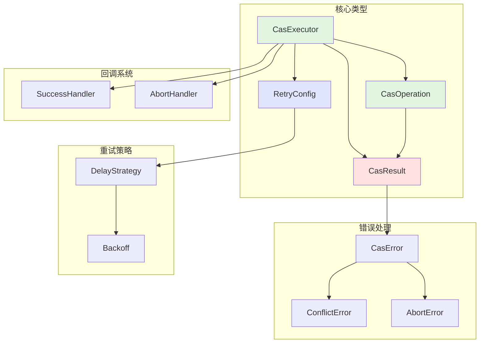

# CAS 执行器 Rust 实现设计方案

**版本**: 1.0
**作者**: Claude
**日期**: 2025-10-15
**原始 Java 实现**: `ltd.qubit.commons.concurrent.cas`

## 一、概述

### 1.1 背景

本文档描述了将 Java 版本的 CAS（Compare-And-Swap）执行器组件移植到 Rust 的详细设计方案。CAS 执行器是一个用于无锁并发编程的高级抽象工具，通过智能的重试机制实现原子性的状态转换操作。

### 1.2 设计目标

1. **保持功能完整性**: 完整移植 Java 版本的所有核心功能
2. **利用 Rust 优势**: 充分利用 Rust 的类型系统、所有权模型和零成本抽象
3. **符合 Rust 风格**: 遵循 Rust 社区的最佳实践和编码规范
4. **提升性能**: 利用 Rust 的编译期优化和无 GC 特性提升性能
5. **增强安全性**: 通过 Rust 的类型系统在编译期保证线程安全

### 1.3 核心特性

- ✅ **智能重试机制**: 支持多种延迟策略（固定、随机、指数退避）
- ✅ **类型安全**: 编译期类型检查，零成本抽象
- ✅ **灵活配置**: Builder 模式配置，预定义场景模板
- ✅ **回调支持**: 成功和中止回调处理
- ✅ **线程安全**: 编译期保证，无数据竞争
- ✅ **高性能**: 零开销抽象，可内联优化

## 二、整体架构

### 2.1 架构图



### 2.2 模块划分

| 模块 | 文件 | 职责 |
|------|------|------|
| 结果类型 | `result.rs` | 定义 CAS 操作的三种结果状态 |
| 操作接口 | `operation.rs` | 定义 CAS 操作的 trait |
| 执行器核心 | `executor.rs` | CAS 执行器的核心逻辑 |
| 构建器 | `builder.rs` | Builder 模式实现 |
| 配置管理 | `config.rs` | 重试配置和策略 |
| 错误处理 | `error.rs` | 错误类型定义 |
| 回调处理 | `handlers.rs` | 回调处理器类型 |
| 延迟策略 | `strategy.rs` | 延迟计算策略 |

## 三、核心类型设计

### 3.1 CasResult - 操作结果

#### 设计理念

使用 Rust 的 `enum` 类型明确表示 CAS 操作的三种可能结果，利用模式匹配提供编译期穷尽性检查。

#### 类型定义

```rust
/// CAS 操作的结果类型
#[derive(Debug, Clone, PartialEq)]
pub enum CasResult<T, E = String> {
    /// 操作成功，包含旧值和新值
    Success {
        old_value: T,
        new_value: T,
    },

    /// 操作失败但可以重试（如并发冲突）
    Retry {
        old_value: T,
        error_code: Option<String>,
        error_message: Option<E>,
        attempts: usize,
    },

    /// 操作被中止，不应重试（如业务逻辑错误）
    Abort {
        old_value: T,
        error_code: Option<String>,
        error_message: Option<E>,
    },
}
```

#### 方法实现

```rust
impl<T, E> CasResult<T, E> {
    /// 创建成功结果
    pub fn success(old_value: T, new_value: T) -> Self {
        Self::Success { old_value, new_value }
    }

    /// 创建可重试的失败结果
    pub fn retry(old_value: T, error_message: impl Into<Option<E>>) -> Self {
        Self::Retry {
            old_value,
            error_code: None,
            error_message: error_message.into(),
            attempts: 0,
        }
    }

    /// 创建带错误码的可重试失败结果
    pub fn retry_with_code(
        old_value: T,
        error_code: impl Into<String>,
        error_message: impl Into<Option<E>>,
        attempts: usize,
    ) -> Self {
        Self::Retry {
            old_value,
            error_code: Some(error_code.into()),
            error_message: error_message.into(),
            attempts,
        }
    }

    /// 创建中止结果
    pub fn abort(old_value: T, error_message: impl Into<Option<E>>) -> Self {
        Self::Abort {
            old_value,
            error_code: None,
            error_message: error_message.into(),
        }
    }

    /// 创建带错误码的中止结果
    pub fn abort_with_code(
        old_value: T,
        error_code: impl Into<String>,
        error_message: impl Into<Option<E>>,
    ) -> Self {
        Self::Abort {
            old_value,
            error_code: Some(error_code.into()),
            error_message: error_message.into(),
        }
    }

    /// 检查是否成功
    pub fn is_success(&self) -> bool {
        matches!(self, Self::Success { .. })
    }

    /// 检查是否失败
    pub fn is_failed(&self) -> bool {
        !self.is_success()
    }

    /// 检查是否应该重试
    pub fn should_retry(&self) -> bool {
        matches!(self, Self::Retry { .. })
    }

    /// 获取旧值的引用
    pub fn old_value(&self) -> &T {
        match self {
            Self::Success { old_value, .. } => old_value,
            Self::Retry { old_value, .. } => old_value,
            Self::Abort { old_value, .. } => old_value,
        }
    }

    /// 获取新值的引用（仅成功时有效）
    pub fn new_value(&self) -> Option<&T> {
        match self {
            Self::Success { new_value, .. } => Some(new_value),
            _ => None,
        }
    }
}
```

#### 设计优势

- ✅ 使用 `enum` 明确表达三种状态，避免布尔标志的歧义
- ✅ 模式匹配提供编译期穷尽性检查
- ✅ 泛型错误类型 `E` 提供灵活性，默认为 `String`
- ✅ 实现 `Clone`、`Debug`、`PartialEq` 便于测试和调试

### 3.2 CasOperation - 操作接口

#### 设计理念

使用 Trait 定义 CAS 操作接口，同时为闭包自动实现该 Trait，提供灵活性和便利性。

#### Trait 定义

```rust
/// CAS 操作的 trait
pub trait CasOperation<T> {
    /// 关联类型：错误类型
    type Error;

    /// 根据当前值计算新值
    ///
    /// # 参数
    ///
    /// * `current` - 当前值的引用
    ///
    /// # 返回值
    ///
    /// 返回 CAS 操作的结果
    fn calculate(&mut self, current: &T) -> CasResult<T, Self::Error>;
}

/// 为闭包自动实现 CasOperation
impl<T, F, E> CasOperation<T> for F
where
    F: FnMut(&T) -> CasResult<T, E>,
{
    type Error = E;

    fn calculate(&mut self, current: &T) -> CasResult<T, E> {
        self(current)
    }
}
```

#### 设计优势

- ✅ 使用 Trait 而非函数式接口，更符合 Rust 惯例
- ✅ 支持 `&mut self`，允许操作保持内部状态
- ✅ 为闭包自动实现，使用便捷
- ✅ 关联类型 `Error` 提供类型灵活性

### 3.3 RetryConfig - 重试配置

#### 延迟策略

```rust
/// 延迟策略
#[derive(Debug, Clone, Copy, PartialEq)]
pub enum DelayStrategy {
    /// 无延迟，立即重试
    NoDelay,

    /// 固定延迟
    Fixed(Duration),

    /// 随机延迟
    Random {
        min: Duration,
        max: Duration,
    },

    /// 指数退避
    ExponentialBackoff {
        initial: Duration,
        max: Duration,
        multiplier: f64,
    },
}

impl DelayStrategy {
    /// 计算指定尝试次数的延迟时间
    pub fn calculate(&self, attempt: usize, jitter_factor: f64) -> Duration {
        let base_delay = match self {
            Self::NoDelay => Duration::ZERO,
            Self::Fixed(d) => *d,
            Self::Random { min, max } => {
                use rand::Rng;
                let mut rng = rand::thread_rng();
                let range = max.as_secs_f64() - min.as_secs_f64();
                let delay_secs = min.as_secs_f64() + rng.gen::<f64>() * range;
                Duration::from_secs_f64(delay_secs)
            }
            Self::ExponentialBackoff { initial, max, multiplier } => {
                let exp_delay = initial.as_secs_f64()
                    * multiplier.powi((attempt.saturating_sub(1)) as i32);
                let capped = exp_delay.min(max.as_secs_f64());
                Duration::from_secs_f64(capped)
            }
        };

        // 应用抖动因子
        if jitter_factor > 0.0 {
            use rand::Rng;
            let mut rng = rand::thread_rng();
            let jitter = base_delay.as_secs_f64()
                * jitter_factor
                * (rng.gen::<f64>() * 2.0 - 1.0);
            let total = base_delay.as_secs_f64() + jitter.abs();
            Duration::from_secs_f64(total.max(0.0))
        } else {
            base_delay
        }
    }
}
```

#### 重试配置

```rust
/// 重试配置
#[derive(Debug, Clone)]
pub struct RetryConfig {
    /// 最大尝试次数
    pub max_attempts: usize,

    /// 最大持续时间
    pub max_duration: Option<Duration>,

    /// 延迟策略
    pub delay_strategy: DelayStrategy,

    /// 抖动因子 (0.0 - 1.0)
    pub jitter_factor: f64,
}

impl Default for RetryConfig {
    fn default() -> Self {
        Self {
            max_attempts: 100,
            max_duration: Some(Duration::from_secs(30)),
            delay_strategy: DelayStrategy::ExponentialBackoff {
                initial: Duration::from_millis(10),
                max: Duration::from_secs(1),
                multiplier: 2.0,
            },
            jitter_factor: 0.1,
        }
    }
}

impl RetryConfig {
    /// 高并发场景配置
    pub fn high_concurrency() -> Self {
        Self {
            max_attempts: 1000,
            max_duration: Some(Duration::from_secs(60)),
            delay_strategy: DelayStrategy::ExponentialBackoff {
                initial: Duration::from_millis(50),
                max: Duration::from_secs(30),
                multiplier: 2.0,
            },
            jitter_factor: 0.25,
        }
    }

    /// 低延迟场景配置
    pub fn low_latency() -> Self {
        Self {
            max_attempts: 100,
            max_duration: Some(Duration::from_secs(5)),
            delay_strategy: DelayStrategy::NoDelay,
            jitter_factor: 0.0,
        }
    }

    /// 高可靠性场景配置
    pub fn high_reliability() -> Self {
        Self {
            max_attempts: 5000,
            max_duration: Some(Duration::from_secs(600)),
            delay_strategy: DelayStrategy::ExponentialBackoff {
                initial: Duration::from_secs(1),
                max: Duration::from_secs(300),
                multiplier: 2.0,
            },
            jitter_factor: 0.1,
        }
    }
}
```

### 3.4 CasError - 错误类型

```rust
use thiserror::Error;

/// CAS 操作的错误类型
#[derive(Debug, Clone, Error)]
pub enum CasError<T> {
    /// 并发冲突，重试次数耗尽
    #[error("CAS operation failed due to conflict after {attempts} attempts")]
    Conflict {
        attempts: usize,
        last_value: T,
    },

    /// 操作被中止
    #[error("CAS operation aborted: {message}")]
    Abort {
        old_value: T,
        error_code: Option<String>,
        message: String,
    },

    /// 超时
    #[error("CAS operation timeout after {duration:?}")]
    Timeout {
        duration: Duration,
        attempts: usize,
    },
}

impl<T> CasError<T> {
    /// 获取旧值的引用
    pub fn old_value(&self) -> Option<&T> {
        match self {
            Self::Conflict { last_value, .. } => Some(last_value),
            Self::Abort { old_value, .. } => Some(old_value),
            Self::Timeout { .. } => None,
        }
    }

    /// 获取尝试次数
    pub fn attempts(&self) -> usize {
        match self {
            Self::Conflict { attempts, .. } => *attempts,
            Self::Timeout { attempts, .. } => *attempts,
            Self::Abort { .. } => 0,
        }
    }
}
```

## 四、核心执行器设计

### 4.1 CasExecutor 结构

```rust
use std::marker::PhantomData;
use std::sync::atomic::{AtomicPtr, Ordering};
use std::time::{Duration, Instant};

/// CAS 执行器
///
/// 提供基于重试机制的 CAS 操作执行器，支持灵活的重试策略配置。
pub struct CasExecutor<T> {
    /// 重试配置
    config: RetryConfig,

    /// 幽灵类型标记
    _phantom: PhantomData<T>,
}

impl<T> CasExecutor<T>
where
    T: Clone + Send + Sync,
{
    /// 创建 Builder
    pub fn builder() -> CasExecutorBuilder<T> {
        CasExecutorBuilder::new()
    }

    /// 使用默认配置创建执行器
    pub fn new() -> Self {
        Self::with_config(RetryConfig::default())
    }

    /// 使用指定配置创建执行器
    pub fn with_config(config: RetryConfig) -> Self {
        Self {
            config,
            _phantom: PhantomData,
        }
    }

    /// 创建高并发场景执行器
    pub fn high_concurrency() -> Self {
        Self::with_config(RetryConfig::high_concurrency())
    }

    /// 创建低延迟场景执行器
    pub fn low_latency() -> Self {
        Self::with_config(RetryConfig::low_latency())
    }

    /// 创建高可靠性场景执行器
    pub fn high_reliability() -> Self {
        Self::with_config(RetryConfig::high_reliability())
    }
}
```

### 4.2 核心执行方法

#### 基础执行方法（Result 版本）

```rust
impl<T> CasExecutor<T>
where
    T: Clone + Send + Sync,
{
    /// 执行 CAS 操作（Result 版本）
    ///
    /// # 参数
    ///
    /// * `atomic_ptr` - 原子指针引用
    /// * `operation` - CAS 操作
    ///
    /// # 返回值
    ///
    /// 成功返回新值，失败返回 CasError
    pub fn try_execute<O>(
        &self,
        atomic_ptr: &AtomicPtr<T>,
        mut operation: O,
    ) -> Result<T, CasError<T>>
    where
        O: CasOperation<T>,
    {
        self.try_execute_with_handlers(
            atomic_ptr,
            operation,
            None::<fn(&T, &T)>,
            None::<fn(&CasResult<T, O::Error>, &CasError<T>)>,
        )
    }

    /// 执行 CAS 操作（panic 版本）
    ///
    /// 失败时会 panic，适合不期望失败的场景
    pub fn execute<O>(
        &self,
        atomic_ptr: &AtomicPtr<T>,
        operation: O,
    ) -> T
    where
        O: CasOperation<T>,
    {
        self.try_execute(atomic_ptr, operation)
            .expect("CAS operation failed")
    }
}
```

#### 带回调的执行方法

```rust
impl<T> CasExecutor<T>
where
    T: Clone + Send + Sync,
{
    /// 执行 CAS 操作（带回调）
    ///
    /// # 参数
    ///
    /// * `atomic_ptr` - 原子指针引用
    /// * `operation` - CAS 操作
    /// * `on_success` - 成功回调
    /// * `on_abort` - 中止回调
    pub fn try_execute_with_handlers<O, S, A>(
        &self,
        atomic_ptr: &AtomicPtr<T>,
        mut operation: O,
        mut on_success: Option<S>,
        mut on_abort: Option<A>,
    ) -> Result<T, CasError<T>>
    where
        O: CasOperation<T>,
        S: FnMut(&T, &T),
        A: FnMut(&CasResult<T, O::Error>, &CasError<T>),
    {
        let start = Instant::now();
        let mut attempts = 0;

        loop {
            attempts += 1;

            // 检查超时
            if let Some(max_duration) = self.config.max_duration {
                if start.elapsed() > max_duration {
                    return Err(CasError::Timeout {
                        duration: start.elapsed(),
                        attempts,
                    });
                }
            }

            // 检查最大尝试次数
            if attempts > self.config.max_attempts {
                // 获取最后的值
                let last_ptr = atomic_ptr.load(Ordering::Acquire);
                let last_value = unsafe { (*last_ptr).clone() };
                return Err(CasError::Conflict {
                    attempts,
                    last_value,
                });
            }

            // 获取当前值
            let current_ptr = atomic_ptr.load(Ordering::Acquire);
            let current_value = unsafe { &*current_ptr };

            // 执行 CAS 操作计算
            let result = operation.calculate(current_value);

            match result {
                CasResult::Success { ref old_value, ref new_value } => {
                    // 尝试 CAS 更新
                    let new_boxed = Box::new(new_value.clone());
                    let new_ptr = Box::into_raw(new_boxed);

                    match atomic_ptr.compare_exchange(
                        current_ptr,
                        new_ptr,
                        Ordering::AcqRel,
                        Ordering::Acquire,
                    ) {
                        Ok(_) => {
                            // CAS 成功
                            if let Some(ref mut callback) = on_success {
                                callback(old_value, new_value);
                            }
                            return Ok(new_value.clone());
                        }
                        Err(_) => {
                            // CAS 失败，释放新分配的内存
                            unsafe {
                                let _ = Box::from_raw(new_ptr);
                            }
                            // 继续重试
                            self.apply_delay(attempts);
                            continue;
                        }
                    }
                }

                CasResult::Retry { .. } => {
                    // 业务逻辑返回重试，应用延迟后继续
                    self.apply_delay(attempts);
                    continue;
                }

                CasResult::Abort { ref old_value, ref error_code, ref error_message } => {
                    // 业务逻辑中止
                    let error = CasError::Abort {
                        old_value: old_value.clone(),
                        error_code: error_code.clone(),
                        message: error_message
                            .as_ref()
                            .map(|e| format!("{:?}", e))
                            .unwrap_or_else(|| "Operation aborted".to_string()),
                    };

                    if let Some(ref mut callback) = on_abort {
                        callback(&result, &error);
                    }

                    return Err(error);
                }
            }
        }
    }

    /// 应用延迟策略
    fn apply_delay(&self, attempt: usize) {
        let delay = self.config.delay_strategy.calculate(
            attempt,
            self.config.jitter_factor,
        );

        if delay > Duration::ZERO {
            std::thread::sleep(delay);
        }
    }
}
```

### 4.3 Builder 实现

```rust
/// CAS 执行器构建器
pub struct CasExecutorBuilder<T> {
    config: RetryConfig,
    _phantom: PhantomData<T>,
}

impl<T> CasExecutorBuilder<T> {
    pub fn new() -> Self {
        Self {
            config: RetryConfig::default(),
            _phantom: PhantomData,
        }
    }

    /// 设置最大尝试次数
    pub fn max_attempts(mut self, attempts: usize) -> Self {
        self.config.max_attempts = attempts;
        self
    }

    /// 设置最大持续时间
    pub fn max_duration(mut self, duration: Duration) -> Self {
        self.config.max_duration = Some(duration);
        self
    }

    /// 设置无时间限制
    pub fn unlimited_duration(mut self) -> Self {
        self.config.max_duration = None;
        self
    }

    /// 设置延迟策略
    pub fn delay_strategy(mut self, strategy: DelayStrategy) -> Self {
        self.config.delay_strategy = strategy;
        self
    }

    /// 设置固定延迟
    pub fn fixed_delay(mut self, delay: Duration) -> Self {
        self.config.delay_strategy = DelayStrategy::Fixed(delay);
        self
    }

    /// 设置随机延迟
    pub fn random_delay(mut self, min: Duration, max: Duration) -> Self {
        self.config.delay_strategy = DelayStrategy::Random { min, max };
        self
    }

    /// 设置指数退避
    pub fn exponential_backoff(
        mut self,
        initial: Duration,
        max: Duration,
        multiplier: f64,
    ) -> Self {
        self.config.delay_strategy = DelayStrategy::ExponentialBackoff {
            initial,
            max,
            multiplier,
        };
        self
    }

    /// 设置无延迟
    pub fn no_delay(mut self) -> Self {
        self.config.delay_strategy = DelayStrategy::NoDelay;
        self
    }

    /// 设置抖动因子
    pub fn jitter_factor(mut self, factor: f64) -> Self {
        assert!((0.0..=1.0).contains(&factor), "Jitter factor must be in [0.0, 1.0]");
        self.config.jitter_factor = factor;
        self
    }

    /// 构建执行器
    pub fn build(self) -> CasExecutor<T> {
        CasExecutor::with_config(self.config)
    }
}

impl<T> Default for CasExecutorBuilder<T> {
    fn default() -> Self {
        Self::new()
    }
}
```

## 五、使用示例

### 5.1 基础使用

```rust
use prism3_concurrent::cas::{CasExecutor, CasResult};
use std::sync::atomic::AtomicPtr;
use std::sync::Arc;

// 创建执行器
let executor = CasExecutor::<i32>::builder()
    .max_attempts(100)
    .exponential_backoff(
        Duration::from_millis(1),
        Duration::from_secs(1),
        2.0,
    )
    .build();

// 创建原子引用
let value = Box::new(0);
let atomic_ptr = AtomicPtr::new(Box::into_raw(value));

// 执行 CAS 操作
let result = executor.try_execute(&atomic_ptr, |current| {
    let next = current + 1;
    if next < 100 {
        CasResult::success(*current, next)
    } else {
        CasResult::abort(*current, Some("已达到最大值".to_string()))
    }
});

match result {
    Ok(new_value) => println!("成功更新为: {}", new_value),
    Err(e) => eprintln!("操作失败: {}", e),
}
```

### 5.2 预定义场景

```rust
// 高并发场景
let high_concurrency = CasExecutor::<String>::high_concurrency();

// 低延迟场景
let low_latency = CasExecutor::<String>::low_latency();

// 高可靠性场景
let high_reliability = CasExecutor::<String>::high_reliability();
```

### 5.3 带回调使用

```rust
use log::info;

let executor = CasExecutor::<i32>::new();

let result = executor.try_execute_with_handlers(
    &atomic_ptr,
    |current| CasResult::success(*current, current + 1),
    Some(|old, new| {
        info!("状态更新成功: {} -> {}", old, new);
    }),
    Some(|result, error| {
        eprintln!("操作被中止: {:?}, 错误: {}", result, error);
    }),
);
```

### 5.4 状态机示例

```rust
#[derive(Debug, Clone, PartialEq)]
enum State {
    Init,
    Processing,
    Done,
    Failed,
}

let executor = CasExecutor::<State>::builder()
    .max_attempts(50)
    .fixed_delay(Duration::from_millis(10))
    .build();

let state = Box::new(State::Init);
let atomic_state = AtomicPtr::new(Box::into_raw(state));

// 状态转换
let result = executor.try_execute(&atomic_state, |current| {
    match current {
        State::Init => CasResult::success(State::Init, State::Processing),
        State::Processing => CasResult::success(State::Processing, State::Done),
        State::Done => CasResult::abort(State::Done, Some("已完成")),
        State::Failed => CasResult::abort(State::Failed, Some("已失败")),
    }
});
```

## 六、与 Java 版本对比

### 6.1 功能对比

| 特性 | Java 实现 | Rust 实现 | 说明 |
|------|----------|----------|------|
| 类型安全 | 泛型 + 接口 | 泛型 + Trait | Rust 更严格的类型检查 |
| 错误处理 | 异常机制 | Result enum | 编译期强制错误处理 |
| 并发安全 | 运行时检查 | 编译期保证 | 零成本并发安全 |
| 内存管理 | GC | 所有权系统 | 无GC暂停，可预测性能 |
| 抽象成本 | 虚方法调用 | 零成本抽象 | 可内联优化，无虚表 |
| 回调机制 | 函数式接口 | FnMut trait | 更灵活的闭包捕获 |

### 6.2 性能优势

| 方面 | Java | Rust | 提升 |
|------|------|------|------|
| 内存分配 | GC 堆 | 栈/堆混合 | 减少堆分配 |
| 调用开销 | 虚方法 | 内联 | 消除调用开销 |
| 并发开销 | synchronized | 原子操作 | 更细粒度控制 |
| 启动时间 | JIT 预热 | AOT 编译 | 无预热时间 |

### 6.3 API 对应关系

| Java API | Rust API | 说明 |
|----------|----------|------|
| `CasResult.success(old, new)` | `CasResult::success(old, new)` | 创建成功结果 |
| `CasResult.retry(old, msg)` | `CasResult::retry(old, msg)` | 创建重试结果 |
| `CasResult.abort(old, msg)` | `CasResult::abort(old, msg)` | 创建中止结果 |
| `CasExecutor.execute()` | `executor.execute()` | 执行（panic版） |
| `CasExecutor.tryExecute()` | `executor.try_execute()` | 执行（Result版） |
| `CasExecutor.builder()` | `CasExecutor::builder()` | 创建构建器 |
| `CasExecutor.highConcurrency()` | `CasExecutor::high_concurrency()` | 高并发场景 |

## 七、实施计划

### 7.1 开发阶段

#### 阶段 1: 基础实现（第 1-2 周）

- [ ] 实现 `CasResult` 类型和方法
- [ ] 实现 `CasOperation` trait
- [ ] 实现 `DelayStrategy` 和 `RetryConfig`
- [ ] 实现 `CasError` 错误类型
- [ ] 基础单元测试

#### 阶段 2: 核心功能（第 2-3 周）

- [ ] 实现 `CasExecutor` 核心逻辑
- [ ] 实现重试循环和延迟策略
- [ ] 实现 `CasExecutorBuilder`
- [ ] 实现回调机制
- [ ] 并发测试

#### 阶段 3: 高级特性（第 3-4 周）

- [ ] 实现预定义场景配置
- [ ] 性能优化和内联
- [ ] 集成测试
- [ ] 压力测试

#### 阶段 4: 完善和文档（第 4-5 周）

- [ ] 完善文档注释
- [ ] 编写使用示例
- [ ] 基准测试
- [ ] API 稳定性审查

### 7.2 测试策略

#### 单元测试

```rust
#[cfg(test)]
mod tests {
    use super::*;

    #[test]
    fn test_cas_result_success() {
        let result = CasResult::<i32, String>::success(1, 2);
        assert!(result.is_success());
        assert_eq!(result.old_value(), &1);
        assert_eq!(result.new_value(), Some(&2));
    }

    #[test]
    fn test_cas_result_retry() {
        let result = CasResult::<i32, String>::retry(1, Some("conflict"));
        assert!(result.should_retry());
        assert!(!result.is_success());
    }

    #[test]
    fn test_cas_result_abort() {
        let result = CasResult::<i32, String>::abort(1, Some("invalid"));
        assert!(!result.should_retry());
        assert!(!result.is_success());
    }
}
```

#### 并发测试

```rust
#[cfg(test)]
mod concurrent_tests {
    use super::*;
    use std::sync::Arc;
    use std::thread;

    #[test]
    fn test_concurrent_increment() {
        let executor = CasExecutor::<i32>::high_concurrency();
        let value = Box::new(0);
        let atomic_ptr = Arc::new(AtomicPtr::new(Box::into_raw(value)));

        let handles: Vec<_> = (0..10)
            .map(|_| {
                let executor = executor.clone();
                let ptr = Arc::clone(&atomic_ptr);
                thread::spawn(move || {
                    for _ in 0..100 {
                        let _ = executor.try_execute(&ptr, |current| {
                            CasResult::success(*current, current + 1)
                        });
                    }
                })
            })
            .collect();

        for handle in handles {
            handle.join().unwrap();
        }

        // 验证最终值
        let final_ptr = atomic_ptr.load(Ordering::Acquire);
        let final_value = unsafe { *final_ptr };
        assert_eq!(final_value, 1000);
    }
}
```

#### 基准测试

```rust
use criterion::{criterion_group, criterion_main, Criterion};

fn benchmark_cas_executor(c: &mut Criterion) {
    let executor = CasExecutor::<i32>::low_latency();
    let value = Box::new(0);
    let atomic_ptr = AtomicPtr::new(Box::into_raw(value));

    c.bench_function("cas_increment", |b| {
        b.iter(|| {
            executor.try_execute(&atomic_ptr, |current| {
                CasResult::success(*current, current + 1)
            })
        })
    });
}

criterion_group!(benches, benchmark_cas_executor);
criterion_main!(benches);
```

## 八、依赖管理

### 8.1 Cargo.toml

```toml
[package]
name = "prism3-concurrent"
version = "0.1.0"
edition = "2021"
authors = ["Your Name <your.email@example.com>"]
description = "CAS executor for concurrent programming"
license = "MIT OR Apache-2.0"

[dependencies]
# 错误处理
thiserror = "2.0"

# 随机数生成
rand = "0.8"

# 日志
log = "0.4"

[dev-dependencies]
# 测试框架
tokio = { version = "1.0", features = ["full"] }

# 基准测试
criterion = "0.5"

# 属性测试
proptest = "1.0"

[features]
default = []
# 异步支持（可选）
async = ["tokio"]

[[bench]]
name = "cas_bench"
harness = false
```

## 九、注意事项

### 9.1 内存安全

1. **AtomicPtr 使用**
   - 必须正确管理 Box 分配的内存
   - 避免悬垂指针和内存泄漏
   - 使用 RAII 模式确保清理

2. **并发访问**
   - 使用正确的内存序（Ordering）
   - AcqRel 用于写操作
   - Acquire 用于读操作

### 9.2 性能优化

1. **内联优化**
   - 对小函数使用 `#[inline]`
   - 对热路径函数使用 `#[inline(always)]`

2. **避免不必要的克隆**
   - 使用引用而非克隆
   - 考虑使用 `Cow` 类型

3. **减少堆分配**
   - 使用栈分配的小对象
   - 考虑对象池模式

### 9.3 API 设计

1. **遵循 Rust 惯例**
   - 方法名使用 snake_case
   - 类型名使用 PascalCase
   - 常量使用 SCREAMING_SNAKE_CASE

2. **错误处理**
   - 优先使用 `Result` 而非 panic
   - 提供有意义的错误信息
   - 实现 `Error` trait

3. **文档注释**
   - 所有公开 API 必须有文档
   - 提供示例代码
   - 说明安全性和性能特点

## 十、总结

本设计方案提供了将 Java CAS 执行器组件移植到 Rust 的完整蓝图。通过充分利用 Rust 的类型系统、所有权模型和零成本抽象，我们可以实现一个既保持原有功能完整性，又具有更高性能和更强安全保证的 Rust 版本。

### 核心优势

1. **类型安全**: 编译期保证，零运行时开销
2. **并发安全**: 所有权系统保证无数据竞争
3. **高性能**: 零成本抽象，可内联优化
4. **内存安全**: 无悬垂指针，无内存泄漏
5. **可维护性**: 清晰的 API 设计，完善的文档

### 后续工作

- [ ] 完成核心实现
- [ ] 编写完整测试套件
- [ ] 性能基准测试
- [ ] 编写用户指南
- [ ] 集成到 CI/CD

---

**版本历史**

- v1.0 (2025-10-15): 初始设计方案

