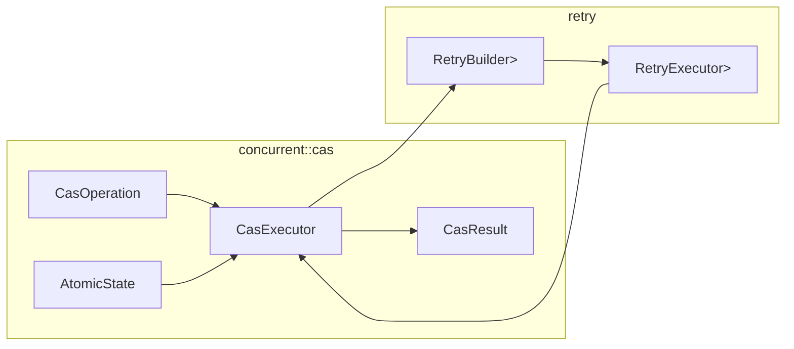

## CAS 执行器 Rust 迁移设计 v1.0

### 1. 背景与目标
- **背景**：现有 Java 版本 `CasExecutor` 基于结果驱动（非异常驱动）的重试策略（Failsafe），提供回调、灵活的延迟/次数/时间限制配置，并将并发冲突与业务中止做出语义区分。
- **目标**：在 Rust 中实现等价能力，同时充分利用 Rust 的类型系统、错误模型与现有 `qubit-retry` 库，保持行为一致、接口 Rust 化、性能和可维护性更优。
- **不做改变**：不改变业务语义；不将异常驱动切换为异常重试；仍以“结果状态（成功/可重试失败/中止）”作为重试决策输入。

### 2. 现有 Java 设计要点（摘要）
- 类型：
  - `CasExecutor<T>`：执行器，整合 Failsafe 重试；区分成功/重试耗尽（并发冲突）/中止（业务逻辑）。
  - `CasResult<T>`：结果包装（success/shouldRetry/oldState/newState/errorCode/errorMessage/attempts）。
  - `CasOperation<T>`：输入 `currentState`，返回成功(新值)或失败(错误码/消息)的结果。
  - 回调：`CasSuccessHandler<T>`、`CasAbortHandler<T>`。
  - 异常：`CasConflictException`（重试耗尽）、`CasAbortException`（业务中止）。
- 重试框架集成：
  - 失败与中止均由“结果”判定（非异常）；异常不参与重试、直接向外传播。
  - 监听器：onRetry 统计尝试次数；onAbort 在“结果中止”触发；成功回调在重试框架外触发。

### 3. Rust 端总体设计
- **核心保持**：结果驱动的重试 + 回调。
- **Rust 化**：以 `Result<T, CasError>` 对外；提供可选“无异常风格”的结构化返回版本（等价 Java 的 `tryExecute`）。
- **依赖复用**：`qubit-retry`（已具备结果/错误两路决策、延迟策略、超时、监听器）；必要时可提供异步版本（真超时中断）。

### 4. 模块与类型（建议放置：`rs-concurrent/src/cas/`）
- `CasResult<T>`
  - 字段：`success: bool`、`should_retry: bool`、`old_state: Arc<T>`（或 `Option<Arc<T>>`）、`new_state: Option<Arc<T>>`、`error_code: Option<String>`、`error_message: Option<String>`、`attempts: u32`。
  - 构造：`success(old, new)`；`retry(old, code, msg, attempts)`；`abort(old, code, msg)`。
  - 约束：若作为重试框架的“结果类型”，需 `Clone + Eq + Hash`；推荐 `T: Clone + Eq + Hash + Send + Sync + 'static` 或在 `CasResult` 上自定义等价性（仅比较状态位/码/消息）。

- `CasOperation<T>`（Trait）
  - `fn calculate(&self, current: &T) -> CasCalcResult<T>`。
  - `CasCalcResult<T> = Result<T, CasAbortInfo>`；其中 `CasAbortInfo { code: Option<String>, message: Option<String> }` 表达“可预期中止”，而非异常。
  - 语义：纯函数、无副作用（可能多次调用）。

- `CasError`
  - `enum CasError { Abort { code: Option<String>, message: Option<String> }, Conflict { attempts: u32, message: Option<String> }, Other(String) }`（`Other` 兜底，将外部异常透传为字符串或具体错误类型，按需扩展）。

- `AtomicState<T>`（状态容器，支持 CAS）
  - 案A（优先）：基于 `arc-swap::ArcSwap<T>`，提供无锁 `load()/compare_and_swap(old,new)`。
  - 案B（备选）：自研 `AtomicArc<T>`（`AtomicPtr<Arc<T>>` + `compare_exchange` + 正确的 Acquire/Release 语义 + `Arc::into_raw/from_raw` 管理所有权），避免三方依赖但涉及 `unsafe`。
  - API 示例：
    - `fn load(&self) -> Arc<T>`
    - `fn compare_exchange(&self, old: &Arc<T>, new: Arc<T>) -> Result<(), ()>`

- `CasExecutor<T>`
  - 线程安全、可复用；内部组合 `RetryBuilder<CasResult<T>>`。
  - Builder 暴露与 Java 对齐的配置（委托给 `qubit-retry`）：`max_attempts`、`max_duration`、`operation_timeout`、`delay_strategy`（fixed/random/exponential_backoff/none）、`jitter_factor`。
  - 回调：`on_success: Option<impl Fn(&T, &T) + Send + Sync>`；`on_abort: Option<impl Fn(&CasResult<T>, &CasError) + Send + Sync>`。
  - 预置模板：
    - `high_concurrency()`：`max_attempts=1000`、`exp_backoff(50ms..30s, ×2.0)`、`jitter=0.25`、`max_duration=60s`。
    - `low_latency()`：`max_attempts=100`、`no_delay()`、`max_duration=5s`。
    - `high_reliability()`：`max_attempts=5000`、`exp_backoff(1s..300s, ×2.0)`、`jitter=0.1`、`max_duration=600s`。

### 5. 执行流程（同步/异步）
- 单步逻辑 `step_once`：
  1) `old = state.load()`；
  2) `op.calculate(&old)` → `Ok(new)` or `Err(abort_info)`；
  3) 若中止：`CasResult::abort(old, code, msg)`；
  4) 若成功：`state.compare_exchange(&old, Arc::new(new))` 成功→`CasResult::success(old,new)`；失败→`CasResult::retry(old, "CAS_CONFLICT", msg, attempts)`。
- 重试集成：
  - `failed_on_results_if(|r| r.is_failed())`；
  - `abort_on_results_if(|r| r.is_failed() && !r.should_retry())`；
  - `no_failed_errors()`（异常透明传播，不参与重试）；
  - 监听器：
    - `on_retry`：更新 `attempts`；
    - `on_abort`：仅在“结果式中止”触发，将 `CasError::Abort` 传给回调；
    - 成功回调在重试框架外触发（异常可自然冒泡）。
- 同步版：`RetryExecutor::run(|| Ok(step_once(...)))`。
- 异步版（可选）：`RetryExecutor::run_async(|| async { Ok(step_once_async(...).await) })`，利用 `tokio::time::timeout` 真正中断超时的单次操作。

### 6. 返回值策略（Rust 化）
- 主 API：
  - `execute(...) -> Result<Arc<T>, CasError>`：成功返回新状态；
  - `execute_with_callbacks(...) -> Result<Arc<T>, CasError>`：附带回调。
- 兼容 API：
  - `try_execute(...) -> OperationResult<T>`（结构化无异常结果，贴近 Java 的 `Result<T>`；可选）。

### 7. 示例代码
```rust
// 假设已选择 ArcSwap 方案作为底层存储
use std::sync::Arc;
use qubit_retry::{RetryBuilder};

// 伪代码：AtomicState（基于 arc-swap）
struct AtomicState<T>(arc_swap::ArcSwap<T>);
impl<T> AtomicState<T> {
    fn new(value: T) -> Self { Self(arc_swap::ArcSwap::from_pointee(value)) }
    fn load(&self) -> Arc<T> { self.0.load_full() }
    fn compare_exchange(&self, old: &Arc<T>, new: Arc<T>) -> Result<(), ()> {
        self.0.compare_and_swap(old.clone(), new); // 简化示意
        // 真实实现需判断是否交换成功，略
        Ok(())
    }
}

// 伪代码：CasExecutor 同步使用
let state = AtomicState::new(0u32);
let executor = RetryBuilder::<CasResult<u32>>::new()
    .set_max_attempts(100)
    .set_no_delay_strategy()
    .build();

// 用户定义的业务计算（<= 纯函数，无副作用）
let op = |current: &u32| -> Result<u32, CasAbortInfo> {
    if *current < 10 { Ok(current + 1) } else { Err(CasAbortInfo::message("已达上限")) }
};

// 单步，交由 RetryExecutor 驱动（概念示意）
// loop 内部由 RetryExecutor 管理
```

### 8. 行为等价性对照
- 保留“结果驱动”核心：异常不参与 Retry；异常向外传播（即 Rust 的 `Err`）。
- 语义区分：
  - **并发冲突重试耗尽** → `CasError::Conflict { attempts }`；
  - **业务中止** → `CasError::Abort { code, message }`；
  - **其他异常** → `CasError::Other`（或上抛具体错误类型，按需拓展）。
- 回调：成功/中止时机与 Java 一致；异常不触发中止回调。

### 9. 线程安全与类型约束
- 建议：`T: Send + Sync + 'static + Clone + Eq + Hash`（与重试框架泛型一致）；若 `T` 较大、Clone 成本高，统一使用 `Arc<T>` 存放，避免大对象复制。
- 原子存储：ArcSwap（优先）或 AtomicPtr 封装，两者均需保证 `Acquire/Release` 语义，避免数据竞争。

### 10. 预置模板映射（对齐 Java）
- `high_concurrency()`：
  - `max_attempts=1000`，`exponential_backoff(50ms, 30s, 2.0)`，`jitter=0.25`，`max_duration=60s`。
- `low_latency()`：
  - `max_attempts=100`，`no_delay()`，`max_duration=5s`。
- `high_reliability()`：
  - `max_attempts=5000`，`exponential_backoff(1s, 300s, 2.0)`，`jitter=0.1`，`max_duration=600s`。

### 11. 重试决策流程（Mermaid）
```mermaid
flowchart TD
    A[load old state (Arc<T>)] --> B[CasOperation.calculate(&old)]
    B -->|Ok(new)| C{compare_exchange(old,new)}
    B -->|Err(abort)| D[CasResult.abort(old, code,msg)] --> H
    C -->|OK| E[CasResult.success(old,new)] --> H
    C -->|Err| F[CasResult.retry(old, "CAS_CONFLICT", msg, attempts)] --> H
    H{RetryBuilder decision}
    H -->|Success| I[on_success(old,new)]
    H -->|Retry| J[delay via strategy] --> A
    H -->|Abort| K[on_abort(result, CasError::Abort)]
```

### 12. 组件关系（Mermaid）


### 13. 测试计划（遵循项目 Rust 测试规范）
- 单元测试（`tests/cas/*`）：
  - `cas_result_tests.rs`：构造器、等价性、序列化（若实现）。
  - `cas_executor_tests.rs`：
    - 成功路径（一次成功、多次重试后成功）。
    - 中止路径（业务校验失败即中止，不重试）。
    - 冲突重试耗尽（正确 attempts 与错误消息）。
    - 模板参数覆盖（高并发/低时延/高可靠）。
  - 监听器：`on_retry`/`on_abort`/`on_success` 触发与参数正确性。
- 并发测试：多线程强竞争下正确性与无数据竞争（可选引入 `loom`）。
- 异步测试（若提供 async API）：
  - `operation_timeout` 真中断；`max_duration` 整体超时；无延迟策略。

### 14. 迁移步骤
1) 确认状态容器选型（推荐 `arc-swap`）。
2) 定义 `CasResult`、`CasOperation`、`CasError`。
3) 实现 `AtomicState` 并提供必要的 CAS API。
4) 集成 `RetryBuilder<CasResult<T>>`，实现同步 `execute(...)`，可选异步版。
5) 实现 Builder 与三套预置模板；暴露回调设置接口。
6) 编写单测/并发测/异步测；完善文档注释（中文、可运行示例）。
7) 示例与使用指南：在 `README` 或 crate 文档中补充最小示例。

### 15. 风险与边界
- `AtomicPtr` 封装需要严格的 `unsafe` 与内存序语义把控，优先 `arc-swap` 以降低风险。
- 若 `T` 不满足 `Eq + Hash`，`CasResult<T>` 在作为重试类型时的等价性语义需谨慎设计（建议对结果结构字段做等价，不直接比较 `T`）。
- 复杂业务中 `CasOperation` 需要避免副作用；副作用请放入成功回调或外部流程。
- 高并发下退避+抖动是关键参数，需要根据生产实测适配。

### 16. 待确认决策点
- 是否允许引入 `arc-swap` 作为依赖（默认建议：是）。
- 是否需要保留“无异常风格”的 `try_execute` 结果返回 API（默认建议：提供）。
- 是否同时提供 `execute_async`（默认建议：提供，覆盖异步业务）。

---
如无异议，可按上述步骤推进实现；实现将严格遵循项目现有 Rust 编码/注释/测试规范，并尽量保持对 Java 行为的一致性与可替换性。


