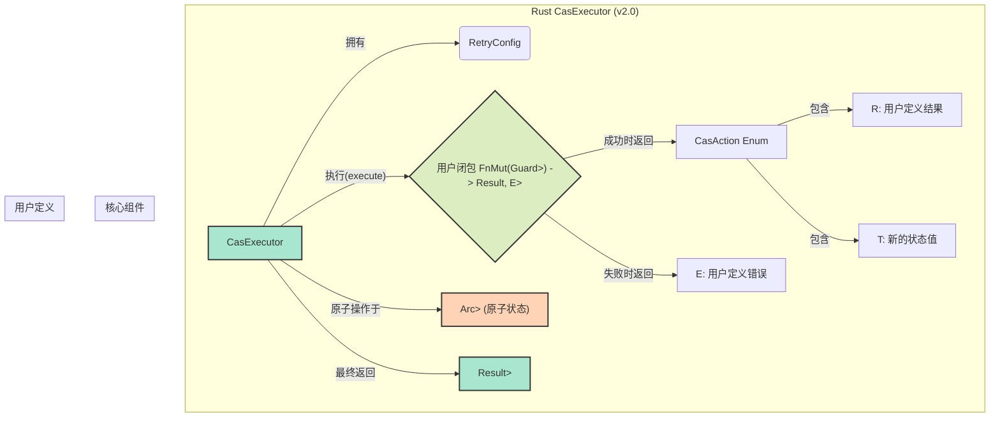

# CAS 执行器 Rust 实现设计方案 (v2.0)

**版本**: 2.0
**作者**: Gemini (综合 Claude 设计)
**日期**: 2025-10-15
**原始 Java 实现**: `ltd.qubit.commons.concurrent.cas.CasExecutor`

## 一、概述

### 1.1 背景

本文档是在 `v1.0` 版本（由 Claude 和 Gemini 分别设计）的基础上，综合两者优点形成的 `v2.0` 设计方案。目标是将 Java 版本的 CAS（Compare-And-Swap）执行器以更安全、高效和符合 Rust 语言习惯的方式进行移植。

`v1.0` 方案分析结论：
- **Gemini 方案 (技术内核)**: 在技术选型上更优，采用 `arc-swap` 避免了 `unsafe`，API 设计更符合 Rust 惯例。
- **Claude 方案 (工程实践)**: 在文档完整性、实施计划、测试策略等方面更详尽，是优秀的工程实践蓝图。

本方案将采用 Gemini 的技术内核，并借鉴 Claude 的工程管理和文档结构。

### 1.2 设计目标

1.  **绝对的内存安全**: 杜绝 `unsafe` 代码，利用 `arc-swap` 和所有权模型在编译期保证线程安全。
2.  **功能完整性**: 完整移植 Java 版本的核心功能，包括智能重试、灵活配置和循环控制。
3.  **符合 Rust 风格**: 遵循 Rust 社区的最佳实践，提供符合人体工程学的 Builder 模式和函数式 API。
4.  **高性能**: 利用 `arc-swap` 的高效读写和 Rust 的零成本抽象，提供优于 Java 版本的性能。
5.  **优秀的扩展性**: 从设计上原生支持同步和异步 (`async/await`) 执行模式。

### 1.3 核心特性

- ✅ **100% 安全的并发**: 使用 `arc-swap`，无需 `unsafe`。
- ✅ **智能重试与退避**: 支持固定、指数退避等多种延迟策略。
- ✅ **清晰的循环控制**: 使用 `CasAction` 枚举明确表达循环体意图。
- ✅ **强大的错误处理**: `Result` 与 `thiserror` 结合，保留完整错误类型。
- ✅ **同步与异步双支持**: 提供 `execute` 和 `execute_async` 方法。
- ✅ **流畅的 API**: 提供 Builder 模式和基于闭包的函数式操作。

## 二、整体架构

### 2.1 架构图



### 2.2 模块划分

| 模块 | 文件 | 职责 |
| :--- | :--- | :--- |
| **执行器核心** | `executor.rs` | 定义 `CasExecutor` 结构体和核心执行逻辑 (`execute`, `execute_async`)。 |
| **配置管理** | `config.rs` | 定义 `RetryConfig` 和 `DelayStrategy`，负责重试策略和配置。 |
| **构建器** | `builder.rs` | `CasExecutor` 的 Builder 模式实现。 |
| **核心类型** | `types.rs` | 定义 `CasAction` 枚举，用于控制循环行为。 |
| **错误处理** | `error.rs` | 定义 `CasError` 错误类型。 |
| **主模块** | `lib.rs` | 组织并导出所有公共 API。 |

## 三、核心类型设计

### 3.1 `CasAction<T, R>` - 循环控制

代替 `v1.0` 方案中混合多种状态的 `CasResult`，`CasAction` 只负责定义单次循环体的行为意图，使逻辑更清晰。

```rust
/// 定义单次 CAS 循环体的行为。
pub enum CasAction<T, R> {
    /// 尝试使用 `new_value` 更新状态。
    /// 如果 CAS 成功，整个操作将成功并返回 `result`。
    Update { new_value: T, result: R },

    /// 不更新状态，但立即成功完成整个操作，并返回 `result`。
    /// 适用于只读检查成功或无需更新的场景。
    Finish { result: R },

    /// 不更新状态，并要求 CasExecutor 立即重试循环。
    /// 适用于需要等待某个外部条件满足的场景。
    Retry,
}
```
**设计优势**:
-   **关注点分离**: 将业务逻辑的成功/失败（由闭包的 `Result` 体现）与 CAS 循环的控制流（由 `CasAction` 体现）完全分开。
-   **意图明确**: `Update`, `Finish`, `Retry` 三种状态清晰地表达了开发者的意图。

### 3.2 `RetryConfig` - 重试配置

(借鉴 Claude 方案的详细设计)

```rust
use std::time::Duration;

/// 重试配置
#[derive(Debug, Clone)]
pub struct RetryConfig {
    pub max_attempts: usize,
    pub max_duration: Option<Duration>,
    pub delay_strategy: DelayStrategy,
    pub jitter_factor: f64, // 0.0 to 1.0
}

/// 延迟策略
#[derive(Debug, Clone, Copy, PartialEq)]
pub enum DelayStrategy {
    NoDelay,
    Fixed(Duration),
    ExponentialBackoff {
        initial: Duration,
        max: Duration,
        multiplier: f64,
    },
}

impl RetryConfig {
    /// 提供适用于高并发场景的预设配置。
    pub fn high_concurrency() -> Self { /* ... */ }

    /// 提供适用于低延迟场景的预设配置。
    pub fn low_latency() -> Self { /* ... */ }
}

// ... DelayStrategy::calculate() 的实现 ...
```

### 3.3 `CasError<E>` - 统一错误类型

(借鉴 Gemini 方案的设计)

```rust
use thiserror::Error;
use std::time::Duration;

/// CAS 执行器返回的错误类型。
#[derive(Debug, Error)]
pub enum CasError<E> {
    #[error("操作在 {duration:?} 后超时，共尝试 {attempts} 次")]
    Timeout {
        duration: Duration,
        attempts: usize,
    },

    #[error("超过最大重试次数: {attempts}")]
    MaxAttemptsExceeded {
        attempts: usize,
    },

    #[error("操作被业务逻辑中止")]
    Aborted(#[from] E), // 通过 #[from] 封装用户闭包返回的错误
}
```
**设计优势**:
-   **类型保持**: 泛型 `E` 使得用户自定义的错误类型得以保留，调用者可以对具体业务错误进行匹配和处理。
-   **集成 `thiserror`**: 提供了清晰的错误信息和符合 Rust 惯例的错误处理。

## 四、核心执行器设计

### 4.1 `CasExecutor` 结构与构建器

```rust
use crate::config::RetryConfig;
use std::marker::PhantomData;

/// CAS 执行器
#[derive(Clone, Debug)]
pub struct CasExecutor<T> {
    config: RetryConfig,
    _phantom: PhantomData<fn() -> T>,
}

pub struct CasExecutorBuilder<T> {
    config: RetryConfig,
    _phantom: PhantomData<fn() -> T>,
}

impl<T> CasExecutor<T> {
    /// 创建一个构建器来定制 CasExecutor。
    pub fn builder() -> CasExecutorBuilder<T> {
        CasExecutorBuilder::new()
    }
}

// Builder 将提供 max_attempts, max_duration, delay_strategy, jitter_factor 等链式配置方法。
```

### 4.2 核心执行方法

采用 `arc-swap` 来保证绝对的内存安全。

```rust
use arc_swap::{ArcSwap, Guard};
use std::sync::Arc;
use crate::{CasAction, CasError, RetryConfig};

impl<T> CasExecutor<T> {
    /// 同步执行 CAS 循环。
    pub fn execute<F, R, E>(
        &self,
        target: &ArcSwap<T>,
        mut body: F,
    ) -> Result<R, CasError<E>>
    where
        T: Send + Sync + 'static,
        R: Send + 'static,
        E: Send + Sync + 'static,
        F: FnMut(Guard<Arc<T>>) -> Result<CasAction<T, R>, E>,
    {
        let start_time = std::time::Instant::now();
        let mut attempts = 0;

        loop {
            // 1. 检查超时和最大重试次数
            attempts += 1;
            // ... 检查逻辑 ...

            // 2. 加载当前值
            let current_guard = target.load();

            // 3. 执行用户闭包
            match body(current_guard) {
                Ok(action) => match action {
                    CasAction::Update { new_value, result } => {
                        let new_arc = Arc::new(new_value);
                        // 4. 执行 CAS
                        if target.compare_and_swap(&current_guard, new_arc).is_ok() {
                            return Ok(result); // CAS 成功，返回结果
                        }
                        // CAS 失败，进入下一次循环
                    }
                    CasAction::Finish { result } => {
                        return Ok(result); // 直接成功
                    }
                    CasAction::Retry => {
                        // 主动请求重试
                    }
                },
                Err(e) => {
                    return Err(CasError::Aborted(e)); // 业务逻辑中止
                }
            }

            // 5. 应用延迟策略并重试
            // ... 延迟逻辑 ...
        }
    }

    /// 异步执行 CAS 循环。
    pub async fn execute_async<F, Fut, R, E>(
        &self,
        target: &ArcSwap<T>,
        mut body: F,
    ) -> Result<R, CasError<E>>
    where
        T: Send + Sync + 'static,
        R: Send + 'static,
        E: Send + Sync + 'static,
        F: FnMut(Guard<Arc<T>>) -> Fut,
        Fut: std::future::Future<Output = Result<CasAction<T, R>, E>> + Send,
    {
        // ... 异步版本的实现，使用 tokio::time::sleep 替代 thread::sleep ...
        todo!()
    }
}
```

## 五、使用示例

```rust
use qubit_concurrent::cas::{CasExecutor, CasAction, DelayStrategy};
use arc_swap::{ArcSwap, Guard};
use std::sync::Arc;
use std::time::Duration;

#[derive(Debug, PartialEq)]
enum MyState {
    Initial,
    Processing,
    Done,
}

#[derive(Debug, Error, PartialEq)]
#[error("操作已在 {0:?} 状态完成，无法继续")]
struct AlreadyDoneError(MyState);

fn main() -> Result<(), Box<dyn std::error::Error>> {
    // 1. 创建执行器
    let executor = CasExecutor::<MyState>::builder()
        .max_attempts(100)
        .delay_strategy(DelayStrategy::Fixed(Duration::from_millis(10)))
        .build();

    // 2. 初始化原子状态
    let state = Arc::new(ArcSwap::new(Arc::new(MyState::Initial)));

    // 3. 执行状态转换
    let result = executor.execute(&state, |current| {
        match **current {
            MyState::Initial => {
                println!("当前状态: Initial, 转换到 -> Processing");
                Ok(CasAction::Update {
                    new_value: MyState::Processing,
                    result: "转换为Processing".to_string(),
                })
            }
            MyState::Processing => {
                println!("当前状态: Processing, 转换到 -> Done");
                Ok(CasAction::Update {
                    new_value: MyState::Done,
                    result: "转换为Done".to_string(),
                })
            }
            MyState::Done => {
                // 返回业务错误，这将中止操作并作为 Err 返回
                Err(AlreadyDoneError(MyState::Done))
            }
        }
    });

    println!("最终结果: {:?}", result);
    println!("最终状态: {:?}", **state.load());
    assert_eq!(**state.load(), MyState::Done);

    Ok(())
}
```

## 六、与 Java 版本对比

| 特性 | Java 实现 | Rust 实现 (v2.0) | 说明 |
| :--- | :--- | :--- | :--- |
| **并发原语** | `AtomicReference<T>` | `ArcSwap<T>` | `ArcSwap` 专为 `Arc` 设计，API 安全且性能高。 |
| **内存安全** | 依赖 GC | 所有权系统 + `Arc` | 编译期保证，无 GC 停顿，性能可预测。 |
| **`unsafe`** | 无 | **无** | 核心优势，100% 安全代码。 |
| **循环控制** | 可变的 `CasResult` 对象 | 返回 `CasAction` 枚举 | Rust 方式更函数式，意图更清晰。 |
| **错误处理** | 异常 | `Result<T, CasError<E>>` | 编译期强制错误处理，保留业务错误类型。 |
| **API 风格** | 面向对象接口 | 函数式闭包 + Builder | 更符合现代 Rust 惯例，灵活且不易出错。 |
| **异步模型** | `CompletableFuture` | `async/await` | 无缝融入 Rust 现代异步生态。 |


## 七、实施计划

(借鉴 Claude 方案的详细计划)

### 阶段 1: 基础实现 (第 1 周)

- [ ] 定义 `RetryConfig` 和 `DelayStrategy`。
- [ ] 定义 `CasAction` 枚举。
- [ ] 定义 `CasError` 错误类型，并集成 `thiserror`。
- [ ] 编写以上类型的单元测试。

### 阶段 2: 核心功能 (第 2-3 周)

- [ ] 实现 `CasExecutorBuilder` 和 `CasExecutor` 结构体。
- [ ] 实现同步的 `execute` 方法，包括完整的重试、超时和延迟逻辑。
- [ ] 编写 `execute` 方法的集成测试，覆盖所有 `CasAction` 分支和 `CasError` 场景。

### 阶段 3: 异步与并发测试 (第 3-4 周)

- [ ] 实现异步的 `execute_async` 方法。
- [ ] 使用 `tokio` 编写并发测试，模拟多线程竞争更新，验证最终结果的正确性。
- [ ] 编写 `execute_async` 的集成测试。

### 阶段 4: 完善和文档 (第 4-5 周)

- [ ] 添加完整的文档注释（doc comments）。
- [ ] 编写更多使用示例，覆盖不同场景。
- [ ] 使用 `criterion` 添加基准测试，与 `Mutex` 或其他锁实现进行性能对比。
- [ ] API 稳定性审查和代码清理。
- [ ] 集成到 CI，确保所有测试通过。

## 八、测试策略

### 单元测试 (`/tests/config_tests.rs`)

```rust
#[test]
fn test_delay_strategy_calculation() {
    let strategy = DelayStrategy::ExponentialBackoff {
        initial: Duration::from_millis(10),
        max: Duration::from_secs(1),
        multiplier: 2.0,
    };
    // attempt 从 1 开始
    assert_eq!(strategy.calculate(1, 0.0), Duration::from_millis(10));
    assert_eq!(strategy.calculate(2, 0.0), Duration::from_millis(20));
    assert_eq!(strategy.calculate(10, 0.0), Duration::from_secs(1)); // Capped at max
}
```

### 并发测试 (`/tests/concurrent_tests.rs`)

```rust
use qubit_concurrent::cas::{CasExecutor, CasAction};
use arc_swap::ArcSwap;
use std::sync::Arc;
use std::thread;

#[test]
fn test_concurrent_increment() {
    // 1. 设置
    let executor = CasExecutor::<i32>::builder().build();
    let value = Arc::new(ArcSwap::new(Arc::new(0)));
    let thread_count = 10;
    let increments_per_thread = 100;

    // 2. 并发执行
    let handles: Vec<_> = (0..thread_count).map(|_| {
        let executor = executor.clone();
        let value_clone = Arc::clone(&value);
        thread::spawn(move || {
            for _ in 0..increments_per_thread {
                let _ = executor.execute(&value_clone, |current| {
                    let new_val = **current + 1;
                    Ok(CasAction::Update { new_value: new_val, result: () })
                });
            }
        })
    }).collect();

    for handle in handles {
        handle.join().unwrap();
    }

    // 3. 验证结果
    let final_value = **value.load();
    assert_eq!(final_value, thread_count * increments_per_thread);
}
```

### 基准测试 (`/benches/cas_benchmark.rs`)

```rust
use criterion::{criterion_group, criterion_main, Criterion};
use qubit_concurrent::cas::{CasExecutor, CasAction};
use arc_swap::ArcSwap;
use std::sync::Arc;

fn cas_increment_benchmark(c: &mut Criterion) {
    let executor = CasExecutor::<i32>::low_latency();
    let value = Arc::new(ArcSwap::new(Arc::new(0)));

    c.bench_function("cas_increment", |b| {
        b.iter(|| {
            executor.execute(&value, |current| {
                Ok(CasAction::Update { new_value: **current + 1, result: () })
            })
        })
    });
}

criterion_group!(benches, cas_increment_benchmark);
criterion_main!(benches);
```

## 九、依赖管理 (`Cargo.toml`)

```toml
[package]
name = "rust-concurrent"
version = "0.1.0"
edition = "2021"

[dependencies]
# 核心并发原语
arc-swap = "1.6"

# 错误处理
thiserror = "1.0"

# 日志 (可选)
log = "0.4"

# 异步运行时 (可选, for async feature)
tokio = { version = "1.0", features = ["time"], optional = true }

[dev-dependencies]
# 异步测试
tokio = { version = "1.0", features = ["full"] }
# 基准测试
criterion = "0.5"

[features]
default = []
# 开启异步支持
async = ["dep:tokio"]

[[bench]]
name = "cas_benchmark"
harness = false
```
