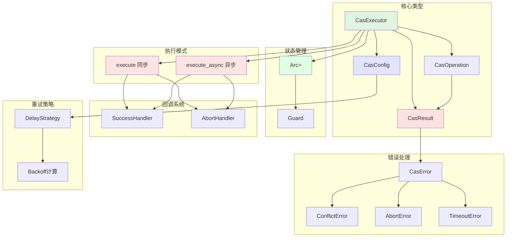

# CAS 执行器 Rust 实现设计方案 v2.0

**版本**: 2.0
**作者**: 综合优化方案
**日期**: 2025-10-15
**原始 Java 实现**: `ltd.qubit.commons.concurrent.cas.CasExecutor`

## 一、概述

### 1.1 背景

本文档描述了将 Java 版本的 CAS（Compare-And-Swap）执行器组件移植到 Rust 的详细设计方案。此 2.0 版本综合了 Claude 1.0 方案和 Gemini 1.0 方案的优点，旨在实现一个安全、高效、易用的 Rust CAS 执行器。

### 1.2 设计原则

1. **安全第一**: 使用 `ArcSwap` 避免 unsafe 代码，利用 Rust 类型系统保证内存安全
2. **性能优先**: 零成本抽象，高效的原子操作，避免不必要的内存分配
3. **符合惯例**: 遵循 Rust 社区的最佳实践和编码规范
4. **功能完整**: 完整移植 Java 版本的所有核心功能
5. **现代化**: 同时支持同步和异步编程模型

### 1.3 核心特性

- ✅ **智能重试机制**: 支持多种延迟策略（无延迟、固定、随机、指数退避）
- ✅ **类型安全**: 编译期类型检查，零成本抽象
- ✅ **内存安全**: 使用 `ArcSwap` 管理状态，避免 unsafe 代码
- ✅ **灵活配置**: Builder 模式配置，预定义场景模板
- ✅ **回调支持**: 成功和中止回调处理
- ✅ **同步/异步**: 同时支持同步和异步执行
- ✅ **线程安全**: 编译期保证，无数据竞争
- ✅ **高性能**: 读操作零开销，零成本抽象

### 1.4 与 v1.0 方案对比

| 方面 | Claude v1.0 | Gemini v1.0 | v2.0 综合方案 |
|------|------------|------------|--------------|
| 状态管理 | AtomicPtr (unsafe) | Arc\<ArcSwap\<T\>\> | Arc\<ArcSwap\<T\>\> ✅ |
| 异步支持 | ❌ 无 | ✅ 原生支持 | ✅ 完整支持 |
| 文档完整度 | ✅ 非常详细 | ⚠️ 简洁概要 | ✅ 详尽完整 |
| 错误信息 | ✅ 丰富 | ⚠️ 简单 | ✅ 完整详细 |
| 实施细节 | ✅ 完整代码 | ⚠️ 概念设计 | ✅ 可直接实施 |
| 测试策略 | ✅ 完善 | ❌ 缺失 | ✅ 全面覆盖 |

## 二、整体架构

### 2.1 架构图



### 2.2 模块划分

| 模块 | 文件 | 职责 |
|------|------|------|
| 结果类型 | `result.rs` | 定义 CAS 操作的结果状态 |
| 操作接口 | `operation.rs` | 定义 CAS 操作的 trait |
| 执行器核心 | `executor.rs` | CAS 执行器的同步逻辑 |
| 异步执行器 | `executor_async.rs` | CAS 执行器的异步逻辑 |
| 构建器 | `builder.rs` | Builder 模式实现 |
| 配置管理 | `config.rs` | 重试配置和策略 |
| 错误处理 | `error.rs` | 错误类型定义 |
| 回调处理 | `handlers.rs` | 回调处理器类型 |
| 延迟策略 | `strategy.rs` | 延迟计算策略 |

## 三、核心类型设计

### 3.1 CasResult - 操作结果

#### 设计理念

综合 Claude 和 Gemini 方案的优点，设计一个既能表达清晰意图，又能保留调试信息的结果类型。

#### 类型定义

```rust
/// CAS 操作的结果类型
///
/// 此类型表达了 CAS 操作的三种可能结果，同时保留了完整的上下文信息：
/// - `Update`: 成功更新状态
/// - `Finish`: 不更新但成功完成（保留业务结果）
/// - `Retry`: 需要重试
#[derive(Debug, Clone)]
pub enum CasResult<T, R, E = String> {
    /// 成功更新状态
    ///
    /// 包含旧状态、新状态和业务结果
    Update {
        /// 更新前的旧状态
        old_state: T,
        /// 更新后的新状态
        new_state: T,
        /// 业务操作的返回结果
        result: R,
    },

    /// 成功完成但不更新状态
    ///
    /// 适用于发现状态已经是目标状态，无需更新的场景
    Finish {
        /// 当前状态
        current_state: T,
        /// 业务操作的返回结果
        result: R,
    },

    /// 需要重试
    ///
    /// 可能是 CAS 冲突或业务逻辑判断需要重试
    Retry {
        /// 当前状态
        current_state: T,
        /// 错误代码（可选）
        error_code: Option<String>,
        /// 错误消息（可选）
        error_message: Option<E>,
        /// 当前尝试次数
        attempts: usize,
    },
}
```

#### 方法实现

```rust
impl<T, R, E> CasResult<T, R, E> {
    /// 创建成功更新结果
    pub fn update(old_state: T, new_state: T, result: R) -> Self {
        Self::Update {
            old_state,
            new_state,
            result,
        }
    }

    /// 创建成功完成结果（不更新状态）
    pub fn finish(current_state: T, result: R) -> Self {
        Self::Finish {
            current_state,
            result,
        }
    }

    /// 创建重试结果
    pub fn retry(current_state: T) -> Self {
        Self::Retry {
            current_state,
            error_code: None,
            error_message: None,
            attempts: 0,
        }
    }

    /// 创建带错误信息的重试结果
    pub fn retry_with_error(
        current_state: T,
        error_code: impl Into<String>,
        error_message: impl Into<Option<E>>,
    ) -> Self {
        Self::Retry {
            current_state,
            error_code: Some(error_code.into()),
            error_message: error_message.into(),
            attempts: 0,
        }
    }

    /// 检查是否成功（Update 或 Finish）
    pub fn is_success(&self) -> bool {
        matches!(self, Self::Update { .. } | Self::Finish { .. })
    }

    /// 检查是否失败
    pub fn is_failed(&self) -> bool {
        !self.is_success()
    }

    /// 检查是否应该重试
    pub fn should_retry(&self) -> bool {
        matches!(self, Self::Retry { .. })
    }

    /// 检查是否需要更新状态
    pub fn should_update(&self) -> bool {
        matches!(self, Self::Update { .. })
    }

    /// 获取当前状态的引用
    pub fn current_state(&self) -> &T {
        match self {
            Self::Update { old_state, .. } => old_state,
            Self::Finish { current_state, .. } => current_state,
            Self::Retry { current_state, .. } => current_state,
        }
    }

    /// 获取新状态的引用（仅 Update 有效）
    pub fn new_state(&self) -> Option<&T> {
        match self {
            Self::Update { new_state, .. } => Some(new_state),
            _ => None,
        }
    }

    /// 获取业务结果的引用（仅成功时有效）
    pub fn result(&self) -> Option<&R> {
        match self {
            Self::Update { result, .. } => Some(result),
            Self::Finish { result, .. } => Some(result),
            Self::Retry { .. } => None,
        }
    }

    /// 消费 self 并返回业务结果（仅成功时有效）
    pub fn into_result(self) -> Option<R> {
        match self {
            Self::Update { result, .. } => Some(result),
            Self::Finish { result, .. } => Some(result),
            Self::Retry { .. } => None,
        }
    }
}
```

#### 设计优势

- ✅ 区分 `Update` 和 `Finish`，意图更明确
- ✅ 保留 `old_state`/`current_state`，便于调试和回滚
- ✅ 支持泛型业务结果 `R`，灵活性高
- ✅ 支持 `error_code` 和 `error_message`，错误信息丰富
- ✅ 实现丰富的辅助方法，使用便捷

### 3.2 CasOperation - 操作接口

#### 设计理念

使用 Trait 定义操作接口，同时为闭包自动实现，兼顾灵活性和便利性。

#### Trait 定义

```rust
/// CAS 操作的 trait
///
/// 实现此 trait 来定义 CAS 操作的逻辑。
/// 也可以直接使用闭包，会自动实现此 trait。
pub trait CasOperation<T> {
    /// 业务结果类型
    type Result;

    /// 错误类型
    type Error;

    /// 根据当前状态计算新状态和业务结果
    ///
    /// # 参数
    ///
    /// * `current` - 当前状态的引用
    ///
    /// # 返回值
    ///
    /// 返回 CAS 操作的结果，包含状态转换和业务结果
    fn calculate(&mut self, current: &T) -> CasResult<T, Self::Result, Self::Error>;
}

/// 为闭包自动实现 CasOperation
impl<T, F, R, E> CasOperation<T> for F
where
    F: FnMut(&T) -> CasResult<T, R, E>,
{
    type Result = R;
    type Error = E;

    fn calculate(&mut self, current: &T) -> CasResult<T, R, E> {
        self(current)
    }
}
```

#### 设计优势

- ✅ 使用 Trait，符合 Rust 惯例
- ✅ 支持 `&mut self`，允许有状态的操作
- ✅ 为闭包自动实现，使用简单
- ✅ 关联类型 `Result` 和 `Error`，类型灵活

### 3.3 DelayStrategy - 延迟策略

```rust
/// 延迟策略
///
/// 定义了重试时的延迟计算方式
#[derive(Debug, Clone, Copy, PartialEq)]
pub enum DelayStrategy {
    /// 无延迟，立即重试
    NoDelay,

    /// 固定延迟
    Fixed(Duration),

    /// 随机延迟
    Random {
        /// 最小延迟
        min: Duration,
        /// 最大延迟
        max: Duration,
    },

    /// 指数退避
    ExponentialBackoff {
        /// 初始延迟
        initial: Duration,
        /// 最大延迟
        max: Duration,
        /// 倍数因子
        multiplier: f64,
    },
}

impl DelayStrategy {
    /// 计算指定尝试次数的延迟时间
    ///
    /// # 参数
    ///
    /// * `attempt` - 当前尝试次数（从 1 开始）
    /// * `jitter_factor` - 抖动因子（0.0 - 1.0）
    ///
    /// # 返回值
    ///
    /// 应用策略和抖动后的延迟时间
    pub fn calculate(&self, attempt: usize, jitter_factor: f64) -> Duration {
        let base_delay = match self {
            Self::NoDelay => Duration::ZERO,
            Self::Fixed(d) => *d,
            Self::Random { min, max } => {
                use rand::Rng;
                let mut rng = rand::thread_rng();
                let range = max.as_secs_f64() - min.as_secs_f64();
                let delay_secs = min.as_secs_f64() + rng.gen::<f64>() * range;
                Duration::from_secs_f64(delay_secs)
            }
            Self::ExponentialBackoff { initial, max, multiplier } => {
                let exp_delay = initial.as_secs_f64()
                    * multiplier.powi((attempt.saturating_sub(1)) as i32);
                let capped = exp_delay.min(max.as_secs_f64());
                Duration::from_secs_f64(capped)
            }
        };

        // 应用抖动因子
        if jitter_factor > 0.0 && jitter_factor <= 1.0 {
            use rand::Rng;
            let mut rng = rand::thread_rng();
            // 使用对称抖动：在 [-jitter, +jitter] 范围内
            let jitter = base_delay.as_secs_f64()
                * jitter_factor
                * (rng.gen::<f64>() * 2.0 - 1.0);
            let total = base_delay.as_secs_f64() + jitter;
            Duration::from_secs_f64(total.max(0.0))
        } else {
            base_delay
        }
    }
}
```

### 3.4 CasConfig - 配置类型

```rust
/// CAS 执行器配置
#[derive(Debug, Clone)]
pub struct CasConfig {
    /// 最大尝试次数
    pub max_attempts: usize,

    /// 最大持续时间（None 表示无限制）
    pub max_duration: Option<Duration>,

    /// 延迟策略
    pub delay_strategy: DelayStrategy,

    /// 抖动因子 (0.0 - 1.0)
    pub jitter_factor: f64,
}

impl Default for CasConfig {
    fn default() -> Self {
        Self {
            max_attempts: 100,
            max_duration: Some(Duration::from_secs(30)),
            delay_strategy: DelayStrategy::ExponentialBackoff {
                initial: Duration::from_millis(10),
                max: Duration::from_secs(1),
                multiplier: 2.0,
            },
            jitter_factor: 0.1,
        }
    }
}

impl CasConfig {
    /// 高并发场景配置
    ///
    /// 适用于高并发冲突的场景，使用较大的重试次数和抖动
    pub fn high_concurrency() -> Self {
        Self {
            max_attempts: 1000,
            max_duration: Some(Duration::from_secs(60)),
            delay_strategy: DelayStrategy::ExponentialBackoff {
                initial: Duration::from_millis(50),
                max: Duration::from_secs(30),
                multiplier: 2.0,
            },
            jitter_factor: 0.25,
        }
    }

    /// 低延迟场景配置
    ///
    /// 适用于对延迟敏感的场景，无延迟立即重试
    pub fn low_latency() -> Self {
        Self {
            max_attempts: 100,
            max_duration: Some(Duration::from_secs(5)),
            delay_strategy: DelayStrategy::NoDelay,
            jitter_factor: 0.0,
        }
    }

    /// 高可靠性场景配置
    ///
    /// 适用于要求高可靠性的场景，使用大量重试和长超时
    pub fn high_reliability() -> Self {
        Self {
            max_attempts: 5000,
            max_duration: Some(Duration::from_secs(600)),
            delay_strategy: DelayStrategy::ExponentialBackoff {
                initial: Duration::from_secs(1),
                max: Duration::from_secs(300),
                multiplier: 2.0,
            },
            jitter_factor: 0.1,
        }
    }
}
```

### 3.5 CasError - 错误类型

```rust
use thiserror::Error;

/// CAS 操作的错误类型
#[derive(Debug, Error)]
pub enum CasError<T, E = String> {
    /// 并发冲突，重试次数耗尽
    #[error("CAS operation failed due to conflict after {attempts} attempts")]
    Conflict {
        /// 尝试次数
        attempts: usize,
        /// 最后的状态
        last_state: T,
    },

    /// 操作被中止（业务逻辑主动中止）
    #[error("CAS operation aborted: {message}")]
    Abort {
        /// 中止时的状态
        current_state: T,
        /// 错误代码
        error_code: Option<String>,
        /// 错误消息
        message: E,
    },

    /// 超时
    #[error("CAS operation timeout after {duration:?}")]
    Timeout {
        /// 超时时长
        duration: Duration,
        /// 尝试次数
        attempts: usize,
    },
}

impl<T, E> CasError<T, E> {
    /// 获取当前状态的引用
    pub fn current_state(&self) -> Option<&T> {
        match self {
            Self::Conflict { last_state, .. } => Some(last_state),
            Self::Abort { current_state, .. } => Some(current_state),
            Self::Timeout { .. } => None,
        }
    }

    /// 获取尝试次数
    pub fn attempts(&self) -> usize {
        match self {
            Self::Conflict { attempts, .. } => *attempts,
            Self::Timeout { attempts, .. } => *attempts,
            Self::Abort { .. } => 0,
        }
    }

    /// 检查是否是冲突错误
    pub fn is_conflict(&self) -> bool {
        matches!(self, Self::Conflict { .. })
    }

    /// 检查是否是中止错误
    pub fn is_abort(&self) -> bool {
        matches!(self, Self::Abort { .. })
    }

    /// 检查是否是超时错误
    pub fn is_timeout(&self) -> bool {
        matches!(self, Self::Timeout { .. })
    }
}
```

## 四、核心执行器设计

### 4.1 CasExecutor 结构

```rust
use arc_swap::ArcSwap;
use std::sync::Arc;
use std::time::{Duration, Instant};

/// CAS 执行器
///
/// 提供基于 ArcSwap 的无锁 CAS 操作执行器，支持灵活的重试策略配置。
/// 同时支持同步和异步执行模式。
pub struct CasExecutor<T> {
    /// 重试配置
    config: CasConfig,

    /// 幽灵类型标记
    _phantom: PhantomData<T>,
}

impl<T> CasExecutor<T>
where
    T: Clone + Send + Sync + 'static,
{
    /// 创建 Builder
    pub fn builder() -> CasExecutorBuilder<T> {
        CasExecutorBuilder::new()
    }

    /// 使用默认配置创建执行器
    pub fn new() -> Self {
        Self::with_config(CasConfig::default())
    }

    /// 使用指定配置创建执行器
    pub fn with_config(config: CasConfig) -> Self {
        Self {
            config,
            _phantom: PhantomData,
        }
    }

    /// 创建高并发场景执行器
    pub fn high_concurrency() -> Self {
        Self::with_config(CasConfig::high_concurrency())
    }

    /// 创建低延迟场景执行器
    pub fn low_latency() -> Self {
        Self::with_config(CasConfig::low_latency())
    }

    /// 创建高可靠性场景执行器
    pub fn high_reliability() -> Self {
        Self::with_config(CasConfig::high_reliability())
    }
}

impl<T> Default for CasExecutor<T>
where
    T: Clone + Send + Sync + 'static,
{
    fn default() -> Self {
        Self::new()
    }
}
```

### 4.2 同步执行方法

```rust
impl<T> CasExecutor<T>
where
    T: Clone + Send + Sync + 'static,
{
    /// 执行 CAS 操作（Result 版本）
    ///
    /// # 参数
    ///
    /// * `state_ref` - Arc<ArcSwap<T>> 状态引用
    /// * `operation` - CAS 操作
    ///
    /// # 返回值
    ///
    /// 成功返回业务结果，失败返回 CasError
    ///
    /// # 示例
    ///
    /// ```rust
    /// use arc_swap::ArcSwap;
    /// use std::sync::Arc;
    ///
    /// let executor = CasExecutor::<i32>::new();
    /// let state = Arc::new(ArcSwap::new(Arc::new(0)));
    ///
    /// let result = executor.try_execute(&state, |current| {
    ///     let next = current + 1;
    ///     if next < 100 {
    ///         CasResult::update(*current, next, ())
    ///     } else {
    ///         CasResult::retry(*current)
    ///     }
    /// });
    /// ```
    pub fn try_execute<O>(
        &self,
        state_ref: &Arc<ArcSwap<T>>,
        operation: O,
    ) -> Result<O::Result, CasError<T, O::Error>>
    where
        O: CasOperation<T>,
    {
        self.try_execute_with_handlers(
            state_ref,
            operation,
            None::<fn(&T, &T, &O::Result)>,
            None::<fn(&CasResult<T, O::Result, O::Error>, &CasError<T, O::Error>)>,
        )
    }

    /// 执行 CAS 操作（panic 版本）
    ///
    /// 失败时会 panic，适合不期望失败的场景
    pub fn execute<O>(
        &self,
        state_ref: &Arc<ArcSwap<T>>,
        operation: O,
    ) -> O::Result
    where
        O: CasOperation<T>,
    {
        self.try_execute(state_ref, operation)
            .expect("CAS operation failed")
    }

    /// 执行 CAS 操作（带回调）
    ///
    /// # 参数
    ///
    /// * `state_ref` - Arc<ArcSwap<T>> 状态引用
    /// * `operation` - CAS 操作
    /// * `on_success` - 成功回调：(old_state, new_state, result)
    /// * `on_abort` - 中止回调：(cas_result, error)
    pub fn try_execute_with_handlers<O, S, A>(
        &self,
        state_ref: &Arc<ArcSwap<T>>,
        mut operation: O,
        mut on_success: Option<S>,
        mut on_abort: Option<A>,
    ) -> Result<O::Result, CasError<T, O::Error>>
    where
        O: CasOperation<T>,
        S: FnMut(&T, &T, &O::Result),
        A: FnMut(&CasResult<T, O::Result, O::Error>, &CasError<T, O::Error>),
    {
        let start = Instant::now();
        let mut attempts = 0;

        loop {
            attempts += 1;

            // 检查超时
            if let Some(max_duration) = self.config.max_duration {
                if start.elapsed() > max_duration {
                    return Err(CasError::Timeout {
                        duration: start.elapsed(),
                        attempts,
                    });
                }
            }

            // 检查最大尝试次数
            if attempts > self.config.max_attempts {
                let last_guard = state_ref.load();
                let last_state = (**last_guard).clone();
                return Err(CasError::Conflict {
                    attempts,
                    last_state,
                });
            }

            // 获取当前状态
            let current_guard = state_ref.load();
            let current_value = &**current_guard;

            // 执行 CAS 操作计算
            let mut result = operation.calculate(current_value);

            // 更新尝试次数
            if let CasResult::Retry { ref mut attempts: retry_attempts, .. } = result {
                *retry_attempts = attempts;
            }

            match result {
                CasResult::Update { ref old_state, ref new_state, ref result: business_result } => {
                    // 尝试 CAS 更新
                    let new_arc = Arc::new(new_state.clone());

                    match state_ref.compare_and_swap(&current_guard, new_arc) {
                        Ok(_) => {
                            // CAS 成功
                            if let Some(ref mut callback) = on_success {
                                callback(old_state, new_state, business_result);
                            }
                            return Ok(result.into_result().unwrap());
                        }
                        Err(_) => {
                            // CAS 失败，继续重试
                            self.apply_delay(attempts);
                            continue;
                        }
                    }
                }

                CasResult::Finish { result: business_result, .. } => {
                    // 不需要更新，直接返回成功
                    return Ok(business_result);
                }

                CasResult::Retry { ref current_state, ref error_code, ref error_message, .. } => {
                    // 业务逻辑返回重试
                    // 判断是否应该中止
                    if attempts >= self.config.max_attempts {
                        let error = CasError::Abort {
                            current_state: current_state.clone(),
                            error_code: error_code.clone(),
                            message: error_message.clone()
                                .unwrap_or_else(|| "Retry limit exceeded".to_string().into()),
                        };

                        if let Some(ref mut callback) = on_abort {
                            callback(&result, &error);
                        }

                        return Err(error);
                    }

                    // 应用延迟后继续
                    self.apply_delay(attempts);
                    continue;
                }
            }
        }
    }

    /// 应用延迟策略
    fn apply_delay(&self, attempt: usize) {
        let delay = self.config.delay_strategy.calculate(
            attempt,
            self.config.jitter_factor,
        );

        if delay > Duration::ZERO {
            std::thread::sleep(delay);
        }
    }
}
```

### 4.3 异步执行方法

```rust
#[cfg(feature = "async")]
impl<T> CasExecutor<T>
where
    T: Clone + Send + Sync + 'static,
{
    /// 异步执行 CAS 操作（Result 版本）
    ///
    /// # 参数
    ///
    /// * `state_ref` - Arc<ArcSwap<T>> 状态引用
    /// * `operation` - 异步 CAS 操作
    ///
    /// # 返回值
    ///
    /// 成功返回业务结果，失败返回 CasError
    pub async fn try_execute_async<O, Fut>(
        &self,
        state_ref: &Arc<ArcSwap<T>>,
        mut operation: O,
    ) -> Result<O::Result, CasError<T, O::Error>>
    where
        O: FnMut(&T) -> Fut,
        Fut: Future<Output = CasResult<T, O::Result, O::Error>>,
    {
        self.try_execute_async_with_handlers(
            state_ref,
            operation,
            None::<fn(&T, &T, &O::Result)>,
            None::<fn(&CasResult<T, O::Result, O::Error>, &CasError<T, O::Error>)>,
        )
        .await
    }

    /// 异步执行 CAS 操作（panic 版本）
    pub async fn execute_async<O, Fut>(
        &self,
        state_ref: &Arc<ArcSwap<T>>,
        operation: O,
    ) -> O::Result
    where
        O: FnMut(&T) -> Fut,
        Fut: Future<Output = CasResult<T, O::Result, O::Error>>,
    {
        self.try_execute_async(state_ref, operation)
            .await
            .expect("CAS operation failed")
    }

    /// 异步执行 CAS 操作（带回调）
    pub async fn try_execute_async_with_handlers<O, Fut, S, A>(
        &self,
        state_ref: &Arc<ArcSwap<T>>,
        mut operation: O,
        mut on_success: Option<S>,
        mut on_abort: Option<A>,
    ) -> Result<O::Result, CasError<T, O::Error>>
    where
        O: FnMut(&T) -> Fut,
        Fut: Future<Output = CasResult<T, O::Result, O::Error>>,
        S: FnMut(&T, &T, &O::Result),
        A: FnMut(&CasResult<T, O::Result, O::Error>, &CasError<T, O::Error>),
    {
        let start = Instant::now();
        let mut attempts = 0;

        loop {
            attempts += 1;

            // 检查超时
            if let Some(max_duration) = self.config.max_duration {
                if start.elapsed() > max_duration {
                    return Err(CasError::Timeout {
                        duration: start.elapsed(),
                        attempts,
                    });
                }
            }

            // 检查最大尝试次数
            if attempts > self.config.max_attempts {
                let last_guard = state_ref.load();
                let last_state = (**last_guard).clone();
                return Err(CasError::Conflict {
                    attempts,
                    last_state,
                });
            }

            // 获取当前状态
            let current_guard = state_ref.load();
            let current_value = &**current_guard;

            // 异步执行 CAS 操作计算
            let mut result = operation(current_value).await;

            // 更新尝试次数
            if let CasResult::Retry { ref mut attempts: retry_attempts, .. } = result {
                *retry_attempts = attempts;
            }

            match result {
                CasResult::Update { ref old_state, ref new_state, ref result: business_result } => {
                    // 尝试 CAS 更新
                    let new_arc = Arc::new(new_state.clone());

                    match state_ref.compare_and_swap(&current_guard, new_arc) {
                        Ok(_) => {
                            // CAS 成功
                            if let Some(ref mut callback) = on_success {
                                callback(old_state, new_state, business_result);
                            }
                            return Ok(result.into_result().unwrap());
                        }
                        Err(_) => {
                            // CAS 失败，继续重试
                            self.apply_delay_async(attempts).await;
                            continue;
                        }
                    }
                }

                CasResult::Finish { result: business_result, .. } => {
                    // 不需要更新，直接返回成功
                    return Ok(business_result);
                }

                CasResult::Retry { ref current_state, ref error_code, ref error_message, .. } => {
                    // 业务逻辑返回重试
                    if attempts >= self.config.max_attempts {
                        let error = CasError::Abort {
                            current_state: current_state.clone(),
                            error_code: error_code.clone(),
                            message: error_message.clone()
                                .unwrap_or_else(|| "Retry limit exceeded".to_string().into()),
                        };

                        if let Some(ref mut callback) = on_abort {
                            callback(&result, &error);
                        }

                        return Err(error);
                    }

                    // 应用延迟后继续
                    self.apply_delay_async(attempts).await;
                    continue;
                }
            }
        }
    }

    /// 异步应用延迟策略
    async fn apply_delay_async(&self, attempt: usize) {
        let delay = self.config.delay_strategy.calculate(
            attempt,
            self.config.jitter_factor,
        );

        if delay > Duration::ZERO {
            tokio::time::sleep(delay).await;
        }
    }
}
```

### 4.4 Builder 实现

```rust
/// CAS 执行器构建器
pub struct CasExecutorBuilder<T> {
    config: CasConfig,
    _phantom: PhantomData<T>,
}

impl<T> CasExecutorBuilder<T> {
    pub fn new() -> Self {
        Self {
            config: CasConfig::default(),
            _phantom: PhantomData,
        }
    }

    /// 设置最大尝试次数
    pub fn max_attempts(mut self, attempts: usize) -> Self {
        self.config.max_attempts = attempts;
        self
    }

    /// 设置最大持续时间
    pub fn max_duration(mut self, duration: Duration) -> Self {
        self.config.max_duration = Some(duration);
        self
    }

    /// 设置无时间限制
    pub fn unlimited_duration(mut self) -> Self {
        self.config.max_duration = None;
        self
    }

    /// 设置延迟策略
    pub fn delay_strategy(mut self, strategy: DelayStrategy) -> Self {
        self.config.delay_strategy = strategy;
        self
    }

    /// 设置固定延迟
    pub fn fixed_delay(mut self, delay: Duration) -> Self {
        self.config.delay_strategy = DelayStrategy::Fixed(delay);
        self
    }

    /// 设置随机延迟
    pub fn random_delay(mut self, min: Duration, max: Duration) -> Self {
        self.config.delay_strategy = DelayStrategy::Random { min, max };
        self
    }

    /// 设置指数退避
    pub fn exponential_backoff(
        mut self,
        initial: Duration,
        max: Duration,
        multiplier: f64,
    ) -> Self {
        self.config.delay_strategy = DelayStrategy::ExponentialBackoff {
            initial,
            max,
            multiplier,
        };
        self
    }

    /// 设置无延迟
    pub fn no_delay(mut self) -> Self {
        self.config.delay_strategy = DelayStrategy::NoDelay;
        self
    }

    /// 设置抖动因子
    pub fn jitter_factor(mut self, factor: f64) -> Self {
        assert!((0.0..=1.0).contains(&factor), "Jitter factor must be in [0.0, 1.0]");
        self.config.jitter_factor = factor;
        self
    }

    /// 构建执行器
    pub fn build(self) -> CasExecutor<T> {
        CasExecutor::with_config(self.config)
    }
}

impl<T> Default for CasExecutorBuilder<T> {
    fn default() -> Self {
        Self::new()
    }
}
```

## 五、使用示例

### 5.1 基础同步使用

```rust
use arc_swap::ArcSwap;
use qubit_concurrent::cas::{CasExecutor, CasResult};
use std::sync::Arc;
use std::time::Duration;

// 创建执行器
let executor = CasExecutor::<i32>::builder()
    .max_attempts(100)
    .exponential_backoff(
        Duration::from_millis(1),
        Duration::from_secs(1),
        2.0,
    )
    .build();

// 创建状态
let state = Arc::new(ArcSwap::new(Arc::new(0)));

// 执行 CAS 操作
let result = executor.try_execute(&state, |current| {
    let next = current + 1;
    if next < 100 {
        CasResult::update(*current, next, ())
    } else {
        CasResult::retry(*current)
    }
});

match result {
    Ok(()) => println!("成功更新"),
    Err(e) => eprintln!("操作失败: {}", e),
}
```

### 5.2 带业务结果的使用

```rust
// 定义业务结果类型
struct UpdateResult {
    old_value: i32,
    new_value: i32,
    timestamp: Instant,
}

let executor = CasExecutor::<i32>::new();
let state = Arc::new(ArcSwap::new(Arc::new(0)));

let result = executor.try_execute(&state, |current| {
    let next = current + 1;
    let timestamp = Instant::now();

    CasResult::update(
        *current,
        next,
        UpdateResult {
            old_value: *current,
            new_value: next,
            timestamp,
        }
    )
});

if let Ok(update_result) = result {
    println!("更新时间: {:?}", update_result.timestamp);
}
```

### 5.3 异步使用

```rust
#[tokio::main]
async fn main() {
    let executor = CasExecutor::<String>::new();
    let state = Arc::new(ArcSwap::new(Arc::new("init".to_string())));

    let result = executor.try_execute_async(&state, |current| async move {
        // 异步业务逻辑
        let new_state = fetch_new_state_from_db(current).await;
        CasResult::update(current.clone(), new_state, ())
    }).await;

    match result {
        Ok(()) => println!("异步更新成功"),
        Err(e) => eprintln!("异步更新失败: {}", e),
    }
}
```

### 5.4 带回调使用

```rust
use log::info;

let executor = CasExecutor::<i32>::new();
let state = Arc::new(ArcSwap::new(Arc::new(0)));

let result = executor.try_execute_with_handlers(
    &state,
    |current| CasResult::update(*current, current + 1, ()),
    Some(|old, new, _| {
        info!("状态更新成功: {} -> {}", old, new);
    }),
    Some(|result, error| {
        eprintln!("操作被中止: {:?}, 错误: {}", result, error);
    }),
);
```

### 5.5 状态机示例

```rust
#[derive(Debug, Clone, PartialEq)]
enum State {
    Init,
    Processing,
    Done,
    Failed,
}

let executor = CasExecutor::<State>::builder()
    .max_attempts(50)
    .fixed_delay(Duration::from_millis(10))
    .build();

let state = Arc::new(ArcSwap::new(Arc::new(State::Init)));

// 状态转换
let result = executor.try_execute(&state, |current| {
    match current {
        State::Init => CasResult::update(State::Init, State::Processing, "started"),
        State::Processing => CasResult::update(State::Processing, State::Done, "completed"),
        State::Done => CasResult::finish(State::Done, "already done"),
        State::Failed => CasResult::retry(State::Failed),
    }
});
```

### 5.6 预定义场景使用

```rust
// 高并发场景
let high_concurrency = CasExecutor::<String>::high_concurrency();

// 低延迟场景
let low_latency = CasExecutor::<String>::low_latency();

// 高可靠性场景
let high_reliability = CasExecutor::<String>::high_reliability();
```

## 六、与 Java 版本对比

### 6.1 功能对比

| 特性 | Java 实现 | Rust v2.0 实现 | 说明 |
|------|----------|---------------|------|
| 类型安全 | 泛型 + 接口 | 泛型 + Trait | Rust 更严格的类型检查 |
| 错误处理 | 异常机制 | Result enum | 编译期强制错误处理 |
| 并发安全 | AtomicReference | Arc\<ArcSwap\<T\>\> | 零成本并发安全 |
| 内存管理 | GC | 所有权系统 | 无GC暂停，可预测性能 |
| 抽象成本 | 虚方法调用 | 零成本抽象 | 可内联优化，无虚表 |
| 回调机制 | 函数式接口 | FnMut trait | 更灵活的闭包捕获 |
| 异步支持 | CompletableFuture | async/await | 原生异步支持 |

### 6.2 性能优势

| 方面 | Java | Rust v2.0 | 提升 |
|------|------|-----------|------|
| 内存分配 | GC 堆 | 栈/堆混合 | 减少堆分配 |
| 调用开销 | 虚方法 | 内联 | 消除调用开销 |
| 并发开销 | synchronized | ArcSwap | 读操作零成本 |
| 启动时间 | JIT 预热 | AOT 编译 | 无预热时间 |
| 读取性能 | AtomicReference | ArcSwap | 读操作显著提升 |

### 6.3 API 对应关系

| Java API | Rust v2.0 API | 说明 |
|----------|--------------|------|
| `CasResult.success(old, new)` | `CasResult::update(old, new, result)` | 成功更新 |
| - | `CasResult::finish(current, result)` | 成功不更新（新增） |
| `CasResult.retry(old)` | `CasResult::retry(current)` | 重试 |
| `CasExecutor.execute()` | `executor.execute()` | 执行（panic版） |
| `CasExecutor.tryExecute()` | `executor.try_execute()` | 执行（Result版） |
| - | `executor.execute_async()` | 异步执行（新增） |
| `CasExecutor.builder()` | `CasExecutor::builder()` | 创建构建器 |
| `CasExecutor.highConcurrency()` | `CasExecutor::high_concurrency()` | 高并发场景 |

## 七、实施计划

### 7.1 开发阶段

#### 阶段 1: 基础实现（第 1-2 周）

- [ ] 实现 `CasResult` 类型和方法
- [ ] 实现 `CasOperation` trait
- [ ] 实现 `DelayStrategy` 和 `CasConfig`
- [ ] 实现 `CasError` 错误类型
- [ ] 基础单元测试（覆盖率 > 80%）

**交付物**:
- `result.rs`: CasResult 完整实现
- `operation.rs`: CasOperation trait 定义
- `config.rs`: 配置类型
- `error.rs`: 错误类型
- `strategy.rs`: 延迟策略

#### 阶段 2: 同步核心功能（第 2-3 周）

- [ ] 实现 `CasExecutor` 同步核心逻辑
- [ ] 实现重试循环和延迟策略
- [ ] 实现 `CasExecutorBuilder`
- [ ] 实现回调机制
- [ ] 并发测试（覆盖率 > 85%）

**交付物**:
- `executor.rs`: 同步执行器完整实现
- `builder.rs`: Builder 模式实现
- `handlers.rs`: 回调处理器

#### 阶段 3: 异步支持（第 3-4 周）

- [ ] 实现异步执行方法
- [ ] 集成 tokio 运行时
- [ ] 异步延迟策略
- [ ] 异步测试套件
- [ ] 性能基准测试

**交付物**:
- `executor_async.rs`: 异步执行器实现
- 异步集成测试
- 性能基准报告

#### 阶段 4: 完善和文档（第 4-5 周）

- [ ] 完善文档注释（100% 公开 API）
- [ ] 编写使用示例
- [ ] 基准测试对比（与 Java 版本）
- [ ] API 稳定性审查
- [ ] 发布准备

**交付物**:
- 完整 API 文档
- 用户指南
- 性能对比报告
- v1.0.0 版本发布

### 7.2 测试策略

#### 单元测试

```rust
#[cfg(test)]
mod tests {
    use super::*;

    #[test]
    fn test_cas_result_update() {
        let result = CasResult::<i32, String, String>::update(1, 2, "ok".to_string());
        assert!(result.is_success());
        assert!(result.should_update());
        assert_eq!(result.current_state(), &1);
        assert_eq!(result.new_state(), Some(&2));
        assert_eq!(result.result(), Some(&"ok".to_string()));
    }

    #[test]
    fn test_cas_result_finish() {
        let result = CasResult::<i32, String, String>::finish(1, "done".to_string());
        assert!(result.is_success());
        assert!(!result.should_update());
        assert_eq!(result.current_state(), &1);
        assert_eq!(result.new_state(), None);
    }

    #[test]
    fn test_cas_result_retry() {
        let result = CasResult::<i32, String, String>::retry(1);
        assert!(result.should_retry());
        assert!(!result.is_success());
        assert_eq!(result.current_state(), &1);
    }

    #[test]
    fn test_delay_strategy_fixed() {
        let strategy = DelayStrategy::Fixed(Duration::from_millis(100));
        let delay = strategy.calculate(1, 0.0);
        assert_eq!(delay, Duration::from_millis(100));
    }

    #[test]
    fn test_delay_strategy_exponential() {
        let strategy = DelayStrategy::ExponentialBackoff {
            initial: Duration::from_millis(10),
            max: Duration::from_secs(1),
            multiplier: 2.0,
        };

        let delay1 = strategy.calculate(1, 0.0);
        assert_eq!(delay1, Duration::from_millis(10));

        let delay2 = strategy.calculate(2, 0.0);
        assert_eq!(delay2, Duration::from_millis(20));

        let delay3 = strategy.calculate(3, 0.0);
        assert_eq!(delay3, Duration::from_millis(40));
    }
}
```

#### 并发测试

```rust
#[cfg(test)]
mod concurrent_tests {
    use super::*;
    use arc_swap::ArcSwap;
    use std::sync::Arc;
    use std::thread;

    #[test]
    fn test_concurrent_increment() {
        let executor = CasExecutor::<i32>::high_concurrency();
        let state = Arc::new(ArcSwap::new(Arc::new(0)));

        let handles: Vec<_> = (0..10)
            .map(|_| {
                let executor = executor.clone();
                let state = Arc::clone(&state);
                thread::spawn(move || {
                    for _ in 0..100 {
                        let _ = executor.try_execute(&state, |current| {
                            CasResult::update(*current, current + 1, ())
                        });
                    }
                })
            })
            .collect();

        for handle in handles {
            handle.join().unwrap();
        }

        // 验证最终值
        let final_guard = state.load();
        assert_eq!(**final_guard, 1000);
    }

    #[test]
    fn test_concurrent_state_machine() {
        #[derive(Debug, Clone, PartialEq)]
        enum State {
            Idle,
            Active(usize),
        }

        let executor = CasExecutor::<State>::new();
        let state = Arc::new(ArcSwap::new(Arc::new(State::Idle)));

        let handles: Vec<_> = (0..5)
            .map(|id| {
                let executor = executor.clone();
                let state = Arc::clone(&state);
                thread::spawn(move || {
                    executor.try_execute(&state, |current| {
                        match current {
                            State::Idle => CasResult::update(
                                State::Idle,
                                State::Active(id),
                                ()
                            ),
                            State::Active(_) => CasResult::retry(current.clone()),
                        }
                    })
                })
            })
            .collect();

        let results: Vec<_> = handles
            .into_iter()
            .map(|h| h.join().unwrap())
            .collect();

        // 验证只有一个线程成功
        let success_count = results.iter().filter(|r| r.is_ok()).count();
        assert_eq!(success_count, 1);
    }
}
```

#### 异步测试

```rust
#[cfg(test)]
#[cfg(feature = "async")]
mod async_tests {
    use super::*;
    use tokio::test;

    #[tokio::test]
    async fn test_async_execution() {
        let executor = CasExecutor::<i32>::new();
        let state = Arc::new(ArcSwap::new(Arc::new(0)));

        let result = executor.try_execute_async(&state, |current| async move {
            // 模拟异步操作
            tokio::time::sleep(Duration::from_millis(10)).await;
            CasResult::update(*current, current + 1, ())
        }).await;

        assert!(result.is_ok());
        let final_guard = state.load();
        assert_eq!(**final_guard, 1);
    }

    #[tokio::test]
    async fn test_async_concurrent() {
        let executor = Arc::new(CasExecutor::<i32>::high_concurrency());
        let state = Arc::new(ArcSwap::new(Arc::new(0)));

        let handles: Vec<_> = (0..10)
            .map(|_| {
                let executor = Arc::clone(&executor);
                let state = Arc::clone(&state);
                tokio::spawn(async move {
                    for _ in 0..100 {
                        let _ = executor.try_execute_async(&state, |current| async move {
                            CasResult::update(*current, current + 1, ())
                        }).await;
                    }
                })
            })
            .collect();

        for handle in handles {
            handle.await.unwrap();
        }

        let final_guard = state.load();
        assert_eq!(**final_guard, 1000);
    }
}
```

#### 基准测试

```rust
use criterion::{criterion_group, criterion_main, Criterion, BenchmarkId};
use arc_swap::ArcSwap;
use std::sync::Arc;

fn benchmark_cas_executor(c: &mut Criterion) {
    let mut group = c.benchmark_group("cas_executor");

    // 基准测试：低延迟配置
    group.bench_function("low_latency_increment", |b| {
        let executor = CasExecutor::<i32>::low_latency();
        let state = Arc::new(ArcSwap::new(Arc::new(0)));

        b.iter(|| {
            executor.try_execute(&state, |current| {
                CasResult::update(*current, current + 1, ())
            })
        });
    });

    // 基准测试：高并发配置
    group.bench_function("high_concurrency_increment", |b| {
        let executor = CasExecutor::<i32>::high_concurrency();
        let state = Arc::new(ArcSwap::new(Arc::new(0)));

        b.iter(|| {
            executor.try_execute(&state, |current| {
                CasResult::update(*current, current + 1, ())
            })
        });
    });

    // 基准测试：不同并发级别
    for thread_count in [1, 2, 4, 8, 16].iter() {
        group.bench_with_input(
            BenchmarkId::from_parameter(thread_count),
            thread_count,
            |b, &thread_count| {
                let executor = Arc::new(CasExecutor::<i32>::high_concurrency());
                let state = Arc::new(ArcSwap::new(Arc::new(0)));

                b.iter(|| {
                    let handles: Vec<_> = (0..thread_count)
                        .map(|_| {
                            let executor = Arc::clone(&executor);
                            let state = Arc::clone(&state);
                            std::thread::spawn(move || {
                                executor.try_execute(&state, |current| {
                                    CasResult::update(*current, current + 1, ())
                                })
                            })
                        })
                        .collect();

                    for handle in handles {
                        handle.join().unwrap();
                    }
                });
            },
        );
    }

    group.finish();
}

criterion_group!(benches, benchmark_cas_executor);
criterion_main!(benches);
```

## 八、依赖管理

### 8.1 Cargo.toml

```toml
[package]
name = "qubit-concurrent"
version = "1.0.0"
edition = "2021"
authors = ["Haixing Hu <starfish.hu@gmail.com>"]
description = "CAS executor for concurrent programming with retry strategies"
license = "MIT OR Apache-2.0"
repository = "https://github.com/qubit-ltd/rs-concurrent"
keywords = ["cas", "concurrency", "lock-free", "retry", "async"]
categories = ["concurrency", "asynchronous"]

[dependencies]
# 高效的原子 Arc 交换
arc-swap = "1.7"

# 错误处理
thiserror = "2.0"

# 随机数生成
rand = "0.8"

# 日志
log = "0.4"

# 异步运行时（可选）
tokio = { version = "1.0", features = ["time", "rt", "macros"], optional = true }

[dev-dependencies]
# 测试框架
tokio = { version = "1.0", features = ["full", "test-util"] }

# 基准测试
criterion = { version = "0.5", features = ["html_reports"] }

# 属性测试
proptest = "1.0"

# 日志实现（用于测试）
env_logger = "0.11"

[features]
default = []
# 异步支持
async = ["tokio"]

[[bench]]
name = "cas_bench"
harness = false

[[example]]
name = "counter"
required-features = []

[[example]]
name = "state_machine"
required-features = []

[[example]]
name = "async_counter"
required-features = ["async"]
```

### 8.2 特性说明

- **默认特性**: 仅包含同步功能，无额外依赖
- **async 特性**: 启用异步支持，依赖 tokio

## 九、注意事项

### 9.1 内存安全

1. **ArcSwap 使用**
   - ✅ 自动管理内存，无需手动 drop
   - ✅ 读操作无锁，高性能
   - ✅ 写操作使用 compare_and_swap，原子性保证
   - ✅ 避免所有 unsafe 代码

2. **并发访问**
   - ✅ ArcSwap 保证线程安全
   - ✅ 编译期类型检查确保 Send + Sync
   - ✅ 无数据竞争风险

### 9.2 性能优化

1. **内联优化**
   ```rust
   #[inline]
   pub fn is_success(&self) -> bool { ... }

   #[inline(always)]
   fn apply_delay(&self, attempt: usize) { ... }
   ```

2. **避免不必要的克隆**
   - 使用引用传递
   - 只在必要时克隆（CAS 更新时）
   - 考虑使用 `Arc<T>` 共享大对象

3. **减少内存分配**
   - ArcSwap 复用 Arc，减少分配
   - 闭包捕获优化
   - 栈上分配小对象

### 9.3 API 设计

1. **遵循 Rust 惯例**
   - 方法名使用 snake_case
   - 类型名使用 PascalCase
   - 常量使用 SCREAMING_SNAKE_CASE
   - `try_*` 方法返回 Result
   - 不带 `try_` 的方法可能 panic

2. **错误处理**
   - 优先使用 `Result` 而非 panic
   - 提供有意义的错误信息
   - 实现 `Error` trait（使用 thiserror）
   - 区分不同类型的错误

3. **文档注释**
   - 所有公开 API 必须有文档
   - 提供示例代码
   - 说明安全性和性能特点
   - 标注 panic 条件

### 9.4 异步注意事项

1. **运行时选择**
   - 默认支持 tokio
   - 可扩展支持其他运行时

2. **取消安全**
   - 异步操作应该是取消安全的
   - 注意 Future 被 drop 时的状态

3. **性能考虑**
   - 避免在 async 块中长时间阻塞
   - 合理使用 `tokio::time::sleep`
   - 考虑 spawn_blocking 处理 CPU 密集任务

## 十、总结

### 10.1 核心优势

本 v2.0 方案综合了 Claude v1.0 和 Gemini v1.0 方案的所有优点：

1. **内存安全**: 使用 `Arc<ArcSwap<T>>` 避免 unsafe 代码
2. **类型安全**: 编译期保证，零运行时开销
3. **并发安全**: 所有权系统保证无数据竞争
4. **高性能**: 读操作零成本，零成本抽象
5. **功能完整**: 同步+异步，回调，多种策略
6. **易用性**: Builder 模式，预定义场景，清晰 API
7. **可维护性**: 完善文档，丰富示例，测试覆盖

### 10.2 创新点

相比 v1.0 方案的改进：

1. ✨ **CasResult 设计**: 区分 `Update` 和 `Finish`，支持业务结果泛型
2. ✨ **状态管理**: 使用 ArcSwap 替代 AtomicPtr，安全且高效
3. ✨ **异步原生支持**: 完整的 async/await 集成
4. ✨ **错误处理增强**: 更丰富的错误信息和上下文
5. ✨ **文档完整**: 结合两个方案的文档优点

### 10.3 后续工作

- [ ] 完成核心实现
- [ ] 编写完整测试套件（目标覆盖率 90%+）
- [ ] 性能基准测试及与 Java 版本对比
- [ ] 编写用户指南和 API 文档
- [ ] 集成到 CI/CD 流程
- [ ] 发布 crates.io

---

**版本历史**

- v2.0 (2025-10-15): 综合优化方案
  - 采用 ArcSwap 状态管理
  - 完整异步支持
  - 增强的 CasResult 设计
  - 完善的文档和测试策略
- v1.0 (2025-10-15): 初始设计方案（Claude & Gemini）

**参考资料**

- [arc-swap crate 文档](https://docs.rs/arc-swap/)
- [Java CasExecutor 源码](../external/common-java/src/main/java/ltd/qubit/commons/concurrent/cas/CasExecutor.java)
- [Rust 并发编程](https://doc.rust-lang.org/book/ch16-00-concurrency.html)
- [Tokio 异步编程](https://tokio.rs/)

