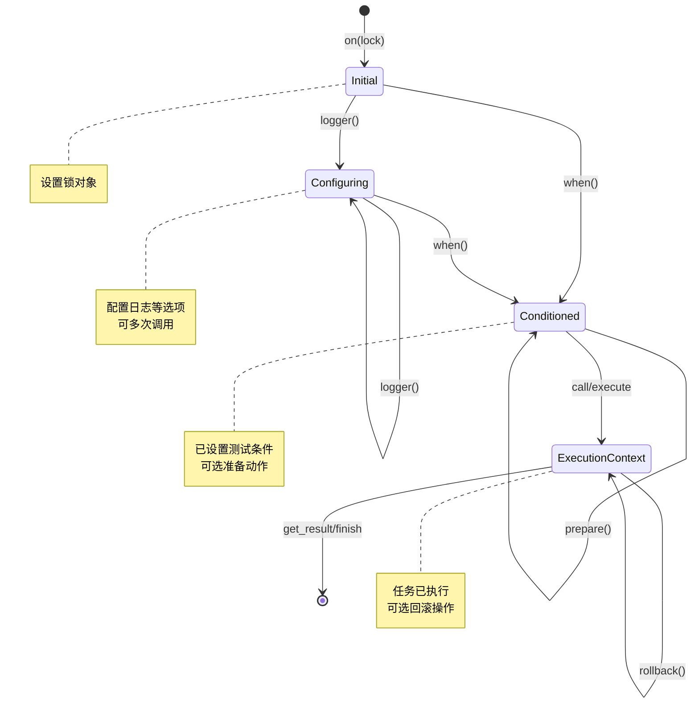

# 双重检查锁执行器（Double-Checked Lock Executor）设计文档

## 1. 概述

本文档描述了如何将 Java 版本的 `DoubleCheckedLockExecutor` 移植到 Rust，充分利用 Rust 的类型系统、所有权模型和并发安全特性。

### 1.1 目标

- 提供与 Java 版本功能等价的 Rust 实现
- 利用 Rust 的编译期保证实现更强的线程安全
- 集成现有的 `prism3-rust-function` 和 `prism3-rust-clock` 组件
- 提供符合 Rust 习惯的 API 设计

### 1.2 适用场景

双重检查锁执行器适用于以下场景：

- 共享状态会在运行时发生变化（例如：服务的启动/停止状态）
- 大部分情况下条件满足，只有少数情况下条件不满足
- 需要在条件满足时执行需要同步保护的操作
- 需要最小化锁竞争，提高并发性能

## 2. Java 版本功能分析

### 2.1 核心功能

1. **双重检查锁模式**
   - 第一次检查：在锁外快速失败
   - 获取锁
   - 第二次检查：在锁内确认条件
   - 执行任务

2. **条件测试器**
   - `BooleanSupplier tester`：用于检查执行条件（Java）
   - Rust 移植：使用 `ArcTester`（来自 `prism3-rust-function`）
   - 依赖的共享状态必须通过线程安全类型（如 `Arc<AtomicBool>`、`Arc<Mutex<T>>`）保证可见性

3. **灵活的错误处理**
   - 可选的日志记录（logger、level、message）
   - 可选的异常抛出（errorSupplier）
   - 支持无栈异常以优化性能

4. **回滚机制**
   - `outsideAction`：锁外准备操作
   - `rollbackAction`：失败时的回滚操作
   - 自动处理回滚异常

5. **多种任务类型**
   - `execute()`：无返回值的任务（Runnable）
   - `call()`：有返回值的任务（Callable）
   - `executeIo()`：可能抛出 IOException 的任务
   - `callIo()`：可能抛出 IOException 且有返回值的任务

### 2.2 关键设计特性

- **Builder 模式**：流式 API 构建执行器
- **异常工厂**：避免并发场景下复用异常导致的栈覆盖问题
- **锁抽象**：支持普通 Lock、ReadLock、WriteLock
- **Result 包装**：封装成功/失败状态和返回值

## 3. Rust 移植方案

### 3.1 总体架构

本设计采用**类型状态机模式（Typestate Pattern）**，通过类型系统在编译期强制执行正确的调用顺序。

```
执行流程：
on(lock) → logger()?  → when(tester) → prepare()? → call/execute → rollback()? → get_result/finish
         ↓                ↓              ↓             ↓              ↓              ↓
      Initial     Configuring      Conditioned    Conditioned   ExecutionContext  完成
```

**核心组件：**
- `DoubleCheckedLockExecutor`：入口点，提供 `on()` 方法
- `ExecutionBuilder<State>`：状态化的构建器，根据状态提供不同方法
- `ExecutionContext`：执行后的上下文，支持 rollback 和结果获取
- `ExecutionResult<T>`：执行结果包装器

**状态转换：**


### 3.2 模块结构

```
prism3-rust-concurrent/
├── src/
│   ├── lib.rs
│   ├── executor.rs           # 执行器接口抽象 trait（Runnable、Callable、Executor 等）
│   ├── lock/                 # 锁模块
│   │   ├── mod.rs
│   │   ├── lock.rs          # Lock trait 定义
│   │   ├── read_write_lock.rs  # ReadWriteLock trait 定义
│   │   ├── arc_mutex.rs     # ArcMutex 包装器
│   │   └── arc_rw_lock.rs   # ArcRwLock 包装器
│   └── double_checked/       # 双重检查锁执行器模块
│       ├── mod.rs           # 模块导出
│       ├── executor.rs      # DoubleCheckedLockExecutor 入口
│       ├── builder.rs       # ExecutionBuilder<State> 实现
│       ├── config.rs        # LogConfig 等配置结构体
│       ├── error.rs         # ExecutorError、BuilderError 定义
│       └── result.rs        # ExecutionResult<T>、ExecutionContext<T>
├── tests/
│   └── double_checked/
│       ├── mod.rs
│       └── executor_tests.rs
├── examples/
│   └── double_checked_lock_demo.rs
└── doc/
    └── double_checked_executor_design.zh_CN.md  # 本文档
```

**模块职责：**
- `executor.rs`：双重检查锁执行器的入口点，提供 `on()` 静态方法
- `builder.rs`：状态化的 ExecutionBuilder，根据类型参数提供不同阶段的方法
- `result.rs`：ExecutionResult（执行结果）和 ExecutionContext（执行上下文）
- `config.rs`：配置结构体（LogConfig 等）
- `error.rs`：错误类型定义

## 4. 类型系统设计

### 4.1 核心结构体

#### 状态标记类型（Zero-Sized Types）

使用零大小类型（ZST）实现类型状态机，在编译期强制执行调用顺序：

```rust
/// 初始状态：已设置锁对象
pub struct Initial;

/// 配置状态：可设置 logger 等配置项
pub struct Configuring;

/// 已设置条件：已调用 when()，可以执行任务
pub struct Conditioned;
```

#### ExecutionBuilder - 状态化构建器

```rust
use prism3_function::{BoxTester, BoxSupplierOnce};

/// 执行构建器（使用类型状态机模式）
///
/// 泛型参数：
/// - `'a`: 锁的生命周期
/// - `L`: 锁类型（实现 Lock<T> trait）
/// - `T`: 被锁保护的数据类型
/// - `State`: 当前状态（Initial、Configuring、Conditioned）
pub struct ExecutionBuilder<'a, L, T, State = Initial>
where
    L: Lock<T>,
{
    lock: &'a L,
    logger: Option<LogConfig>,
    tester: Option<BoxTester>,
    prepare_action: Option<BoxSupplierOnce<Result<(), Box<dyn Error>>>>,
    _phantom: PhantomData<(T, State)>,
}
```

**设计要点：**
- 使用类型参数 `State` 控制可用的方法
- 零成本抽象：状态类型在编译后完全消失
- 编译期检查：错误的调用顺序会导致编译错误
- 使用 `prism3-function` 的 trait 统一闭包类型

#### DoubleCheckedLockExecutor - 入口点

```rust
/// 双重检查锁执行器入口
///
/// 提供静态方法 `on()` 开始构建执行流程
pub struct DoubleCheckedLockExecutor;

impl DoubleCheckedLockExecutor {
    /// 开始构建双重检查锁执行
    ///
    /// # 参数
    /// - `lock`: 要操作的锁对象引用
    ///
    /// # 返回值
    /// 返回 Initial 状态的 ExecutionBuilder
    pub fn on<'a, L, T>(lock: &'a L) -> ExecutionBuilder<'a, L, T, Initial>
    where
        L: Lock<T>,
    {
        // 初始化 builder
    }
}
```

#### ExecutionContext - 执行后的上下文

```rust
use prism3_function::BoxSupplierOnce;

/// 执行上下文（任务执行后的状态）
///
/// 泛型参数：
/// - `'a`: 生命周期
/// - `T`: 任务返回值类型
pub struct ExecutionContext<'a, T> {
    result: ExecutionResult<T>,
    rollback_action: Option<BoxSupplierOnce<Result<(), Box<dyn Error>>>>,
}
```

**职责：**
- 持有执行结果
- 可选地设置和执行 rollback 操作
- 提供 `get_result()` 和 `finish()` 方法

#### 配置结构体

```rust
/// 日志配置
pub struct LogConfig {
    /// 日志级别
    pub level: log::Level,

    /// 日志消息
    pub message: String,
}
```

#### 为何使用 `BoxTester`？

`prism3-rust-function` 提供了三种 Tester 实现：`BoxTester`、`RcTester` 和 `ArcTester`。新设计使用 `BoxTester`，原因如下：

**1. 临时性使用**
- `ExecutionBuilder` 的生命周期很短，仅在一次执行流程中存在
- 从 `on()` 到 `get_result/finish` 是一个完整的调用链，不需要跨线程共享
- 使用 `BoxTester` 避免不必要的 `Arc` 引用计数开销

**2. 线程安全由外部保证**
- 测试条件（tester）捕获的共享状态必须是线程安全的（`Arc<AtomicBool>`、`Arc<Mutex<T>>` 等）
- 闭包本身不需要跨线程传递，因此不需要 `Send + Sync` 约束
- 锁对象（`lock`）的生命周期由调用方控制

**3. 灵活性更高**
- `BoxTester` 允许捕获任何类型的数据（包括非 `Send` 类型）
- 适用于单线程场景下的优化

**设计权衡：**
- 如果将来需要将 `ExecutionBuilder` 存储为结构体字段或跨线程传递，可以改用 `ArcTester`
- 当前设计优先考虑简洁性和性能

#### 为何使用 `prism3-function` 的闭包 Trait？

本设计采用 `prism3-function` 提供的闭包 trait 来统一参数类型，而不是直接使用原生闭包：

**1. 使用 `SupplierOnce` 替代 `FnOnce() -> T`**
- **应用场景**：`prepare` 和 `rollback` 参数
- **原因**：
  - 提供统一的类型抽象：`BoxSupplierOnce<Result<(), E>>`
  - 语义清晰：supplier 表示"提供者"，符合这些动作的含义
  - 支持灵活存储：可以用 `Box`、`Rc`、`Arc` 包装（虽然当前只需要 `Box`）
  - 提供统一的转换方法：`into_box()`

**2. 使用 `FunctionOnce` 替代 `FnOnce(&T) -> R`**
- **应用场景**：`call` 和 `execute` 参数（只读任务）
- **原因**：
  - 统一抽象：`BoxFunctionOnce<T, Result<R, E>>`
  - 语义明确：function 接受输入并产生输出
  - 与 `prism3-function` 生态一致
  - 便于未来扩展（如添加组合操作、缓存等）

**3. 使用 `MutatingFunctionOnce` 替代 `FnOnce(&mut T) -> R`**
- **应用场景**：`call_mut` 和 `execute_mut` 参数（可变任务）
- **原因**：
  - 语义精确：mutating function 明确表示会修改输入
  - 类型统一：`BoxMutatingFunctionOnce<T, Result<R, E>>`
  - 与其他 function trait 保持一致性
  - 填补 `prism3-function` 的 gap（`MutatorOnce` 不返回值）

**4. 设计一致性**

| 闭包签名 | 直接使用 | Trait 抽象 | 用途 |
|---------|---------|-----------|------|
| `FnOnce() -> T` | `FnOnce() -> Result<(), E>` | `SupplierOnce<Result<(), E>>` | prepare、rollback |
| `FnOnce(&T) -> R` | `FnOnce(&T) -> Result<R, E>` | `FunctionOnce<T, Result<R, E>>` | call、execute |
| `FnOnce(&mut T) -> R` | `FnOnce(&mut T) -> Result<R, E>` | `MutatingFunctionOnce<T, Result<R, E>>` | call_mut、execute_mut |

**5. 优势总结**
- ✅ 类型系统更清晰：通过 trait 名称即可理解语义
- ✅ 代码可读性更强：`BoxFunctionOnce` 比 `Box<dyn FnOnce(&T) -> R>` 更简洁
- ✅ 与项目生态一致：`prism3-function` 是项目的核心基础库
- ✅ 便于测试和 mock：trait 比原生闭包更容易模拟
- ✅ 未来扩展性：可以基于这些 trait 提供更多组合器

### 4.2 结果类型

```rust
/// 任务执行结果
///
/// 类似 Java 版本的 `Result<T>` 类，但为了避免与 Rust 标准库的 `Result` 混淆，
/// 命名为 `ExecutionResult`
pub struct ExecutionResult<T> {
    /// 执行是否成功
    pub success: bool,

    /// 成功时的返回值（仅当 success = true 时有值）
    pub value: Option<T>,

    /// 失败时的错误信息（仅当 success = false 时有值）
    pub error: Option<Box<dyn std::error::Error + Send + Sync>>,
}

impl<T> ExecutionResult<T> {
    /// 创建成功结果
    pub fn succeed(value: T) -> Self { /* ... */ }

    /// 创建条件不满足的结果（无错误信息）
    pub fn unmet() -> Self { /* ... */ }

    /// 创建失败结果（带错误信息）
    pub fn fail<E: Error>(error: E) -> Self { /* ... */ }

    /// 从 boxed error 创建失败结果
    pub fn fail_with_box(error: Box<dyn Error + Send + Sync>) -> Self { /* ... */ }

    /// 转换为标准 Result
    pub fn into_result(self) -> Result<T, Box<dyn Error + Send + Sync>> { /* ... */ }
}
```

**ExecutionResult 的三种状态：**
1. **成功**：`success = true`，`value = Some(...)`
2. **条件不满足**：`success = false`，`error = None`（使用 `unmet()`）
3. **失败**：`success = false`，`error = Some(...)`（使用 `fail()`）

### 4.3 错误类型

```rust
/// 执行器错误类型
#[derive(Debug, thiserror::Error)]
pub enum ExecutorError {
    /// 条件不满足
    #[error("Double-checked lock condition not met")]
    ConditionNotMet,

    /// 条件不满足，带自定义消息
    #[error("Double-checked lock condition not met: {0}")]
    ConditionNotMetWithMessage(String),

    /// 任务执行失败
    #[error("Task execution failed: {0}")]
    TaskFailed(String),

    /// 回滚操作失败
    #[error("Rollback failed: original error = {original}, rollback error = {rollback}")]
    RollbackFailed {
        original: String,
        rollback: String,
    },

    /// 锁中毒（Mutex/RwLock poison）
    #[error("Lock poisoned: {0}")]
    LockPoisoned(String),
}

/// Builder 错误类型
#[derive(Debug, thiserror::Error)]
pub enum BuilderError {
    /// 缺少必需的 tester 参数
    #[error("Tester function is required")]
    MissingTester,
}
```

## 5. 锁抽象设计

### 5.1 现有 Lock 模块设计

本项目的 `lock` 模块已经提供了一套完善的锁抽象系统，包括：

**Trait 定义：**
- `Lock<T>` - 同步锁 trait（为 `std::sync::Mutex<T>` 实现）
- `ReadWriteLock<T>` - 同步读写锁 trait（为 `std::sync::RwLock<T>` 实现）
- `AsyncLock<T>` - 异步锁 trait（为 `tokio::sync::Mutex<T>` 实现）
- `AsyncReadWriteLock<T>` - 异步读写锁 trait（为 `tokio::sync::RwLock<T>` 实现）

**包装器实现：**
- `ArcMutex<T>` - Arc 包装的同步互斥锁
- `ArcRwLock<T>` - Arc 包装的同步读写锁
- `ArcAsyncMutex<T>` - Arc 包装的异步互斥锁
- `ArcAsyncRwLock<T>` - Arc 包装的异步读写锁

**设计哲学：**
- 通过闭包隐藏 Guard 生命周期复杂性
- RAII 自动释放锁
- 提供统一的 API 接口
- 支持编写泛型代码

### 5.2 Lock Trait API

```rust
/// 同步锁 trait
pub trait Lock<T: ?Sized> {
    /// 获取锁并执行闭包
    fn with_lock<R, F>(&self, f: F) -> R
    where
        F: FnOnce(&mut T) -> R;

    /// 尝试获取锁（非阻塞）
    fn try_with_lock<R, F>(&self, f: F) -> Option<R>
    where
        F: FnOnce(&mut T) -> R;
}

/// 同步读写锁 trait
pub trait ReadWriteLock<T: ?Sized> {
    /// 获取读锁并执行闭包
    fn read<R, F>(&self, f: F) -> R
    where
        F: FnOnce(&T) -> R;

    /// 获取写锁并执行闭包
    fn write<R, F>(&self, f: F) -> R
    where
        F: FnOnce(&mut T) -> R;
}
```

### 5.3 双重检查锁执行器集成策略

**方案选择**：直接使用 `Lock` 和 `ReadWriteLock` trait 作为泛型约束

**优点**：
- 充分利用现有的锁抽象
- 支持所有实现了这些 trait 的锁类型
- API 设计一致，易于使用和理解
- 自动处理锁的生命周期

**支持的锁类型**：
```rust
// 标准库类型（通过 trait 实现）
use std::sync::{Mutex, RwLock};

// 包装器类型（推荐用于跨线程共享）
use crate::lock::{ArcMutex, ArcRwLock};

// 异步版本（未来扩展）
use crate::lock::{ArcAsyncMutex, ArcAsyncRwLock};
```

## 6. API 设计

### 6.1 流式 API 概览

新的 API 设计使用类型状态机模式，强制执行正确的调用顺序：

```
DoubleCheckedLockExecutor::on(&lock)  // → ExecutionBuilder<Initial>
    .logger(level, message)?           // → ExecutionBuilder<Configuring>
    .when(tester)                      // → ExecutionBuilder<Conditioned>
    .prepare(action)?                  // → ExecutionBuilder<Conditioned>
    .call(task)                        // → ExecutionContext<T>
    .rollback(action)?                 // → ExecutionContext<T>
    .get_result()                      // → ExecutionResult<T>
```

### 6.2 入口点：DoubleCheckedLockExecutor

```rust
impl DoubleCheckedLockExecutor {
    /// 开始构建双重检查锁执行
    ///
    /// # 参数
    /// - `lock`: 要操作的锁对象（实现 `Lock<T>` 或 `ReadWriteLock<T>` trait）
    ///
    /// # 返回值
    /// 返回 Initial 状态的 ExecutionBuilder
    ///
    /// # 示例
    /// ```rust
    /// use prism3_concurrent::{DoubleCheckedLockExecutor, lock::ArcMutex};
    ///
    /// let data = ArcMutex::new(42);
    /// let result = DoubleCheckedLockExecutor::on(&data)
    ///     .when(|| true)
    ///     .call(|value| Ok(*value))
    ///     .get_result();
    /// ```
    pub fn on<'a, L, T>(lock: &'a L) -> ExecutionBuilder<'a, L, T, Initial>
    where
        L: Lock<T>,
    {
        // 创建 Initial 状态的 builder
    }
}
```

### 6.3 Initial 状态：配置或设置条件

在 Initial 状态，可以选择配置日志，也可以直接设置条件：

```rust
impl<'a, L, T> ExecutionBuilder<'a, L, T, Initial>
    where
    L: Lock<T>,
{
    /// 配置日志（可选）
    ///
    /// # 状态转换
    /// Initial → Configuring
    pub fn logger(
        self,
        level: log::Level,
        message: impl Into<String>,
    ) -> ExecutionBuilder<'a, L, T, Configuring> {
        // 转换到 Configuring 状态
    }

    /// 设置测试条件（必需）
    ///
    /// # 状态转换
    /// Initial → Conditioned
    pub fn when<Tst>(
        self,
        tester: Tst,
    ) -> ExecutionBuilder<'a, L, T, Conditioned>
    where
        Tst: Tester + 'static,
    {
        // 转换到 Conditioned 状态
    }
}
```

### 6.4 Configuring 状态：继续配置或设置条件

```rust
impl<'a, L, T> ExecutionBuilder<'a, L, T, Configuring>
where
    L: Lock<T>,
{
    /// 继续配置日志（可覆盖之前的配置）
    ///
    /// # 状态转换
    /// Configuring → Configuring
    pub fn logger(
        mut self,
        level: log::Level,
        message: impl Into<String>,
    ) -> Self {
        // 保持在 Configuring 状态
    }

    /// 设置测试条件（必需）
    ///
    /// # 状态转换
    /// Configuring → Conditioned
    pub fn when<Tst>(
        self,
        tester: Tst,
    ) -> ExecutionBuilder<'a, L, T, Conditioned>
    where
        Tst: Tester + 'static,
    {
        // 转换到 Conditioned 状态
    }
}
```

### 6.5 Conditioned 状态：准备和执行

```rust
use prism3_function::{SupplierOnce, FunctionOnce, MutatingFunctionOnce};

impl<'a, L, T> ExecutionBuilder<'a, L, T, Conditioned>
where
    L: Lock<T>,
{
    /// 设置准备动作（可选，在第一次检查和加锁之间执行）
    ///
    /// # 参数
    /// - `prepare_action`: 实现 `SupplierOnce<Result<(), E>>` 的任意类型
    ///
    /// # 状态转换
    /// Conditioned → Conditioned
    pub fn prepare<S, E>(mut self, prepare_action: S) -> Self
    where
        S: SupplierOnce<Result<(), E>> + 'static,
        E: Error + Send + Sync + 'static,
    {
        // 保持在 Conditioned 状态
    }

    /// 执行只读任务（返回值）
    ///
    /// # 参数
    /// - `task`: 实现 `FunctionOnce<T, Result<R, E>>` 的任意类型
    ///
    /// # 执行流程
    /// 1. 第一次检查条件（锁外）
    /// 2. 执行 prepare 动作（如果有）
    /// 3. 获取锁
    /// 4. 第二次检查条件（锁内）
    /// 5. 执行任务
    ///
    /// # 状态转换
    /// Conditioned → ExecutionContext<R>
    pub fn call<F, R, E>(self, task: F) -> ExecutionContext<'a, R>
    where
        F: FunctionOnce<T, Result<R, E>> + 'static,
        E: Error + Send + Sync + 'static,
    {
        // 执行并返回 ExecutionContext
    }

    /// 执行读写任务（返回值）
    ///
    /// # 参数
    /// - `task`: 实现 `MutatingFunctionOnce<T, Result<R, E>>` 的任意类型
    ///
    /// # 状态转换
    /// Conditioned → ExecutionContext<R>
    pub fn call_mut<F, R, E>(self, task: F) -> ExecutionContext<'a, R>
    where
        F: MutatingFunctionOnce<T, Result<R, E>> + 'static,
        E: Error + Send + Sync + 'static,
    {
        // 执行并返回 ExecutionContext
    }

    /// 执行只读任务（无返回值）
    ///
    /// # 参数
    /// - `task`: 实现 `FunctionOnce<T, Result<(), E>>` 的任意类型
    pub fn execute<F, E>(self, task: F) -> ExecutionContext<'a, ()>
    where
        F: FunctionOnce<T, Result<(), E>> + 'static,
        E: Error + Send + Sync + 'static,
    {
        self.call(task)
    }

    /// 执行读写任务（无返回值）
    ///
    /// # 参数
    /// - `task`: 实现 `MutatingFunctionOnce<T, Result<(), E>>` 的任意类型
    pub fn execute_mut<F, E>(self, task: F) -> ExecutionContext<'a, ()>
    where
        F: MutatingFunctionOnce<T, Result<(), E>> + 'static,
        E: Error + Send + Sync + 'static,
    {
        self.call_mut(task)
    }
}
```

### 6.6 ExecutionContext：回滚和获取结果

```rust
use prism3_function::SupplierOnce;

impl<'a, T> ExecutionContext<'a, T> {
    /// 设置回滚操作（可选，仅在失败时执行）
    ///
    /// # 参数
    /// - `rollback_action`: 实现 `SupplierOnce<Result<(), E>>` 的任意类型
    ///
    /// # 注意
    /// rollback 只在 `success = false` 时才会被设置和执行
    pub fn rollback<S, E>(mut self, rollback_action: S) -> Self
    where
        S: SupplierOnce<Result<(), E>> + 'static,
        E: Error + Send + Sync + 'static,
    {
        // 仅在失败时设置 rollback
    }

    /// 获取执行结果（消耗 context）
    ///
    /// 如果设置了 rollback 且执行失败，会先执行 rollback 再返回结果
    pub fn get_result(mut self) -> ExecutionResult<T> {
        // 执行 rollback（如果需要）并返回结果
    }

    /// 检查执行结果（不消耗 context）
    pub fn peek_result(&self) -> &ExecutionResult<T> {
        &self.result
    }

    /// 检查是否成功
    pub fn is_success(&self) -> bool {
        self.result.success
    }
}

// 为无返回值的情况提供便捷方法
impl<'a> ExecutionContext<'a, ()> {
    /// 完成执行（针对无返回值的操作）
    ///
    /// 返回执行是否成功
    pub fn finish(self) -> bool {
        let result = self.get_result();
        result.success
    }
}
```

### 6.7 读写锁支持

对于读写锁，API 设计略有不同：

```rust
use prism3_function::{FunctionOnce, MutatingFunctionOnce};

// 使用读锁（只读操作）
impl<'a, L, T> ExecutionBuilder<'a, L, T, Conditioned>
where
    L: ReadWriteLock<T>,
{
    /// 使用读锁执行只读任务
    pub fn call<F, R, E>(self, task: F) -> ExecutionContext<'a, R>
    where
        F: FunctionOnce<T, Result<R, E>> + 'static,
        E: Error + Send + Sync + 'static,
    {
        // 使用 lock.read() 执行
    }
}

// 使用写锁（读写操作）
impl<'a, L, T> ExecutionBuilder<'a, L, T, Conditioned>
where
    L: ReadWriteLock<T>,
{
    /// 使用写锁执行读写任务
    pub fn call_mut<F, R, E>(self, task: F) -> ExecutionContext<'a, R>
    where
        F: MutatingFunctionOnce<T, Result<R, E>> + 'static,
        E: Error + Send + Sync + 'static,
    {
        // 使用 lock.write() 执行
    }
}
```

### 6.8 设计优势

**1. 编译期安全保证**
- 错误的调用顺序会导致编译错误
- 不可能跳过 `when()` 直接执行任务
- 类型系统强制执行最佳实践

**2. 灵活的配置时机**
- 配置项（logger）在条件设置之前
- 准备动作（prepare）在执行之前
- 回滚操作（rollback）在执行之后

**3. 清晰的语义**
- `call/execute` → 执行任务
- `get_result` → 获取完整结果
- `finish` → 仅获取成功/失败状态

**4. 统一的 Trait 抽象**
- 使用 `prism3-function` 的 trait 统一闭包类型
- 通过 trait 名称即可理解参数语义（Supplier、Function、MutatingFunction）
- 便于测试、mock 和未来扩展
- 与项目整体生态保持一致

**5. 零成本抽象**
- 状态类型在编译后完全消失
- trait 通过静态分发，无虚函数调用开销
- 闭包自动转换为 trait，无运行时开销
- 与手写代码性能相同

## 7. 使用示例

### 7.1 基础用法（懒加载初始化）

```rust
use std::sync::Arc;
use std::sync::atomic::{AtomicBool, Ordering};
use prism3_concurrent::{DoubleCheckedLockExecutor, lock::ArcMutex};

// 懒加载初始化示例
let resource = ArcMutex::new(None::<String>);
let initialized = Arc::new(AtomicBool::new(false));

let result = DoubleCheckedLockExecutor::on(&resource)
    // when 接受 Tester trait，闭包会自动转换
    .when({
        let initialized = initialized.clone();
        move || !initialized.load(Ordering::Acquire)
    })
    // call_mut 接受 MutatingFunctionOnce<T, Result<R, E>> trait
    // FnOnce(&mut T) -> Result<R, E> 闭包会自动转换
    .call_mut(|data| {
        *data = Some("Initialized Resource".to_string());
        initialized.store(true, Ordering::Release);
        Ok::<(), std::io::Error>(())
    })
    .get_result();

assert!(result.success);
assert!(initialized.load(Ordering::Acquire));
```

**说明：**
- 普通闭包会自动转换为对应的 trait（`Tester`、`FunctionOnce`、`MutatingFunctionOnce`、`SupplierOnce`）
- 无需手动包装或转换，API 使用体验保持简洁
- 如果需要复用或预先构造这些对象，可以使用 `BoxTester`、`BoxFunctionOnce` 等显式类型

### 7.2 带日志配置的用法

```rust
let result = DoubleCheckedLockExecutor::on(&resource)
    .logger(log::Level::Warn, "Condition not met, skipping initialization")
    .when(|| !initialized.load(Ordering::Acquire))
    .call_mut(|data| {
        // 执行初始化
        Ok(())
    })
    .get_result();
```

### 7.3 完整流程（配置 + 准备 + 执行 + 回滚）

```rust
use std::sync::{Arc, atomic::{AtomicBool, Ordering}};
use prism3_concurrent::{DoubleCheckedLockExecutor, lock::ArcMutex};

let balance = ArcMutex::new(1000);
let transaction_active = Arc::new(AtomicBool::new(false));
let connection_opened = Arc::new(AtomicBool::new(false));
let transaction_rolled_back = Arc::new(AtomicBool::new(false));

let result = DoubleCheckedLockExecutor::on(&balance)
    .logger(log::Level::Info, "Transaction already active")    // 1. 配置日志
    .when({                                                     // 2. 设置条件
        let transaction_active = transaction_active.clone();
        move || !transaction_active.load(Ordering::Acquire)
    })
    // 3. 准备动作：FnOnce() -> Result<(), E> 自动转换为 SupplierOnce
    .prepare({
        let connection_opened = connection_opened.clone();
        move || {
            connection_opened.store(true, Ordering::Release);
            Ok::<(), std::io::Error>(())
        }
    })
    // 4. 执行任务：FnOnce(&mut T) -> Result<R, E> 自动转换为 MutatingFunctionOnce
    .call_mut(|amount| {
        if *amount >= 100 {
            *amount -= 100;
            transaction_active.store(true, Ordering::Release);
            Ok::<i32, std::io::Error>(*amount)
        } else {
            Err(std::io::Error::new(
                std::io::ErrorKind::Other,
                "Insufficient balance"
            ))
        }
    })
    // 5. 失败时回滚：FnOnce() -> Result<(), E> 自动转换为 SupplierOnce
    .rollback({
        let transaction_rolled_back = transaction_rolled_back.clone();
        move || {
            transaction_rolled_back.store(true, Ordering::Release);
            Ok::<(), std::io::Error>(())
        }
    })
    .get_result();                                            // 6. 获取结果

assert!(result.success);
```

### 7.4 无返回值操作使用 finish()

```rust
let success = DoubleCheckedLockExecutor::on(&resource)
    .logger(log::Level::Debug, "Resource already initialized")
    .when(|| !is_initialized())
    .prepare(|| setup_connection())
    .execute_mut(|data| {
        // 执行初始化
        Ok(())
    })
    .rollback(|| cleanup_connection())
    .finish();  // 直接返回 bool

if success {
    println!("Initialization successful");
}
```

### 7.5 实际应用：服务状态管理

下面是一个完整的服务状态管理示例，展示如何在实际应用中使用双重检查锁执行器：

```rust
use std::sync::Arc;
use std::sync::atomic::{AtomicBool, Ordering};
use prism3_concurrent::{DoubleCheckedLockExecutor, lock::ArcMutex};

struct Service {
    running: Arc<AtomicBool>,
    pool_size: ArcMutex<i32>,
    cache_size: ArcMutex<i32>,
}

impl Service {
    pub fn new() -> Self {
        Self {
            running: Arc::new(AtomicBool::new(false)),
            pool_size: ArcMutex::new(0),
            cache_size: ArcMutex::new(0),
        }
    }

    pub fn start(&self) {
        self.running.store(true, Ordering::Release);
    }

    pub fn stop(&self) {
        self.running.store(false, Ordering::Release);
    }

    /// 设置线程池大小（仅在服务运行时）
    pub fn set_pool_size(&self, size: i32) -> Result<(), String> {
        let result = DoubleCheckedLockExecutor::on(&self.pool_size)
            .logger(log::Level::Error, "Service is not running")
            .when({
                let running = self.running.clone();
                move || running.load(Ordering::Acquire)
            })
            .call_mut(|pool_size| {
            if size <= 0 {
                    return Err(std::io::Error::new(
                        std::io::ErrorKind::InvalidInput,
                        "pool size must be positive"
                    ));
            }
            *pool_size = size;
                Ok(*pool_size)
            })
            .get_result();

        if result.success {
            Ok(())
        } else {
            Err("Failed to set pool size".to_string())
        }
    }

    /// 获取线程池大小
    pub fn get_pool_size(&self) -> Option<i32> {
        let result = DoubleCheckedLockExecutor::on(&self.pool_size)
            .when({
                let running = self.running.clone();
                move || running.load(Ordering::Acquire)
            })
            .call(|pool_size| Ok(*pool_size))
            .get_result();

        result.value
    }
}

// 使用示例
fn main() -> Result<(), Box<dyn std::error::Error>> {
    let service = Arc::new(Service::new());

    // 启动服务
    service.start();

    // 在多个线程中并发修改配置
    let s1 = service.clone();
    let t1 = std::thread::spawn(move || {
        s1.set_pool_size(10).unwrap();
    });

    let s2 = service.clone();
    let t2 = std::thread::spawn(move || {
        s2.set_cache_size(100).unwrap();
    });

    t1.join().unwrap();
    t2.join().unwrap();

    println!("Pool size: {:?}", service.get_pool_size());

    // 停止服务后尝试修改配置（应该失败）
    service.stop();

    match service.set_pool_size(20) {
        Ok(_) => println!("Unexpected success"),
        Err(e) => println!("Expected failure: {}", e),
    }

    Ok(())
}
```

### 7.6 使用读写锁

```rust
use std::sync::{Arc, atomic::{AtomicBool, Ordering}};
use std::collections::HashMap;
use prism3_concurrent::{DoubleCheckedLockExecutor, lock::ArcRwLock};

struct Cache {
    active: Arc<AtomicBool>,
    data: ArcRwLock<HashMap<String, String>>,
}

impl Cache {
    pub fn new() -> Self {
        Self {
            active: Arc::new(AtomicBool::new(true)),
            data: ArcRwLock::new(HashMap::new()),
        }
    }

    /// 读取缓存（使用读锁）
    pub fn get(&self, key: &str) -> Option<String> {
        let key = key.to_string();
        let result = DoubleCheckedLockExecutor::on(&self.data)
            .when({
                let active = self.active.clone();
                move || active.load(Ordering::Acquire)
            })
            // call：FnOnce(&T) -> Result<R, E> 自动转换为 FunctionOnce
            .call(|cache| Ok(cache.get(&key).cloned()))
            .get_result();

        result.value.flatten()
    }

    /// 写入缓存（使用写锁）
    pub fn set(&self, key: String, value: String) -> Result<(), String> {
        let result = DoubleCheckedLockExecutor::on(&self.data)
            .when({
                let active = self.active.clone();
                move || active.load(Ordering::Acquire)
            })
            // call_mut：FnOnce(&mut T) -> Result<R, E> 自动转换为 MutatingFunctionOnce
            .call_mut(|cache| {
                cache.insert(key, value);
                Ok::<(), std::io::Error>(())
            })
            .get_result();

        if result.success {
            Ok(())
        } else {
            Err("Failed to set cache value".to_string())
        }
    }
}
```

## 8. Java vs Rust 关键差异对照

### 8.1 API 风格对比

| 特性 | Java 版本 | Rust 新设计 | 说明 |
|------|---------|------------|------|
| **构建方式** | `builder()` → 配置 → `build()` | `on()` → 配置 → `when()` → 执行 | Rust 使用流式 API，无需 build() |
| **状态管理** | 运行时检查 | 编译期类型状态机 | Rust 在编译期强制正确顺序 |
| **锁抽象** | `Lock` 接口 | `Lock<T>` / `ReadWriteLock<T>` trait | Rust 的锁直接保护数据 |
| **回滚时机** | 提前配置 | 执行后可选 | Rust 允许根据结果决定是否回滚 |
| **执行器生命周期** | 长期存储 | 临时使用 | Rust 的 builder 是临时的 |

### 8.2 类型系统对比

| 特性 | Java 版本 | Rust 版本 | 说明 |
|-----|---------|---------|------|
| **异常处理** | 异常（Exception） | `Result<T, E>` | Rust 使用显式错误处理，更安全 |
| **锁卫士** | 手动 lock/unlock | RAII Guard（隐藏在 trait 中） | Rust 自动释放锁，避免忘记 unlock |
| **闭包风格** | Lambda 接受锁卫士 | 闭包接受数据引用 | Rust 通过 trait 隐藏 Guard 生命周期 |
| **Volatile** | `volatile` 字段 | `Arc<AtomicXxx>` | Rust 通过类型系统保证可见性 |
| **线程安全** | `synchronized` / `volatile` | `Send` + `Sync` trait | 编译期检查，零运行时开销 |
| **泛型** | 类型擦除 | 单态化 | Rust 保留类型信息，性能更好 |

## 9. 重要注意事项

### 9.1 编译期保证

新的类型状态机设计提供了强大的编译期保证：

```rust
// ✅ 正确：按顺序调用
let result = DoubleCheckedLockExecutor::on(&lock)
    .when(|| true)
    .call(|data| Ok(*data))
    .get_result();

// ❌ 编译错误：跳过 when() 直接 call()
let result = DoubleCheckedLockExecutor::on(&lock)
    .call(|data| Ok(*data));  // 错误：Initial 状态没有 call() 方法

// ❌ 编译错误：when() 之前调用 prepare()
let result = DoubleCheckedLockExecutor::on(&lock)
    .prepare(|| Ok(()))  // 错误：Initial 状态没有 prepare() 方法
    .when(|| true);
```

### 9.2 使用 Lock Trait 的优势

使用 `Lock` 和 `ReadWriteLock` trait 的好处：

```rust
// ✅ 推荐：使用 trait，自动管理锁的生命周期
use prism3_rust_concurrent::lock::{Lock, ArcMutex};

let data = ArcMutex::new(42);
DoubleCheckedLockExecutor::on(&data)
    .when(|| true)
    .call_mut(|value| {
    *value += 1;  // 闭包自动接收 &mut i32
    Ok(*value)
    })
    .get_result(); // 锁自动释放

// ❌ 不推荐：手动管理锁（容易出错）
let guard = data.lock().unwrap();
*guard += 1;
drop(guard);  // 可能忘记释放
```

### 9.3 Volatile 替代方案

Java 的 `volatile` 在 Rust 中没有直接对应物，需要使用以下方案：

```rust
// ✅ 推荐方案1：AtomicBool（适用于简单布尔状态）
use std::sync::atomic::{AtomicBool, Ordering};
let state = Arc::new(AtomicBool::new(false));
DoubleCheckedLockExecutor::on(&lock)
    .when({
        let state = state.clone();
        move || state.load(Ordering::Acquire)
    })
    .call(|data| Ok(*data));

// ✅ 推荐方案2：ArcMutex（适用于复杂状态）
use prism3_rust_concurrent::lock::ArcMutex;
let state = ArcMutex::new(State::Running);
let state_clone = state.clone();
DoubleCheckedLockExecutor::on(&lock)
    .when(move || {
    state_clone.with_lock(|s| *s == State::Running)
})
    .call(|data| Ok(*data));
```

### 9.4 选择合适的锁类型

根据使用场景选择锁类型：

| 场景 | 推荐锁类型 | 原因 |
|-----|----------|------|
| 简单互斥访问 | `ArcMutex<T>` | 简单直接，性能好 |
| 读多写少 | `ArcRwLock<T>` | 允许并发读取 |
| 条件状态检查 | `Arc<AtomicBool>` | 无锁，性能最优 |
| 异步场景 | `ArcAsyncMutex<T>` | 不阻塞异步运行时 |

### 9.5 性能考虑

1. **高并发失败场景**：如果预期条件检查会频繁失败，确保 tester 闭包尽可能轻量

2. **锁竞争**：任务应尽量简短，避免在锁内执行耗时操作

3. **日志开销**：在性能敏感场景，考虑使用条件编译或运行时开关控制日志

4. **零成本抽象**：类型状态机在编译期完全消失，没有运行时开销

### 9.6 错误处理最佳实践

```rust
use prism3_rust_concurrent::lock::{Lock, ArcMutex};

// ✅ 推荐：使用 ExecutionResult 检查成功状态
let data = ArcMutex::new(42);
let result = DoubleCheckedLockExecutor::on(&data)
    .when(|| true)
    .call(|value| Ok(*value))
    .get_result();

if result.success {
    let value = result.value.unwrap();
    println!("Value: {}", value);
} else {
    if let Some(error) = result.error {
        log::error!("Execution failed: {}", error);
    }
}

// ✅ 推荐：转换为标准 Result
let value = result.into_result()?;
```

## 10. 参考资料

### 10.1 项目内部资料

- [Java 版本源码](../external/common-java/src/main/java/ltd/qubit/commons/concurrent/DoubleCheckedLockExecutor.java)
- [prism3-rust-concurrent Lock 模块](../src/lock/)
  - [Lock trait](../src/lock/lock.rs)
  - [ReadWriteLock trait](../src/lock/read_write_lock.rs)
  - [ArcMutex 包装器](../src/lock/arc_mutex.rs)
  - [ArcRwLock 包装器](../src/lock/arc_rw_lock.rs)
- [prism3-rust-function 文档](../../prism3-rust-function/README.md)

### 10.2 外部资料

- [Rust 并发模型](https://doc.rust-lang.org/book/ch16-00-concurrency.html)
- [Rust Atomics and Locks](https://marabos.nl/atomics/)
- [std::sync 模块文档](https://doc.rust-lang.org/std/sync/)
- [Typestate Pattern in Rust](https://cliffle.com/blog/rust-typestate/)

## 11. 变更历史

| 版本 | 日期 | 作者 | 变更说明 |
|-----|------|------|---------|
| 1.0 | 2025-01-XX | AI Assistant | 初始版本 |
| 1.1 | 2025-01-22 | AI Assistant | 根据重构后的 lock 模块更新设计 |
| 2.0 | 2025-01-29 | AI Assistant | 重大重构：引入类型状态机模式 |

**主要变更内容（v2.0）：**
- 采用类型状态机模式（Typestate Pattern）强制执行调用顺序
- 改变 API 流程：从 `builder()` 模式改为 `on()` 流式 API
- 配置项（logger）在 `when()` 之前设置
- `rollback()` 在任务执行后可选调用
- 新增 `ExecutionContext` 类型，支持执行后的操作
- 使用 `BoxTester` 替代 `ArcTester`（临时使用场景）
- 使用 `prism3-function` 的 trait 统一闭包类型：
  - `SupplierOnce<Result<(), E>>` 用于 `prepare` 和 `rollback`
  - `FunctionOnce<T, Result<R, E>>` 用于 `call` 和 `execute`
  - `MutatingFunctionOnce<T, Result<R, E>>` 用于 `call_mut` 和 `execute_mut`
- 添加状态转换图和编译期保证说明

---

**文档状态**：设计稿
**最后更新**：2025-01-29
**审阅者**：待定
